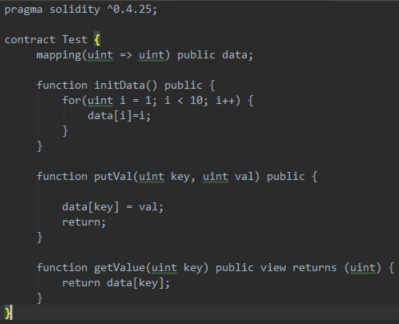
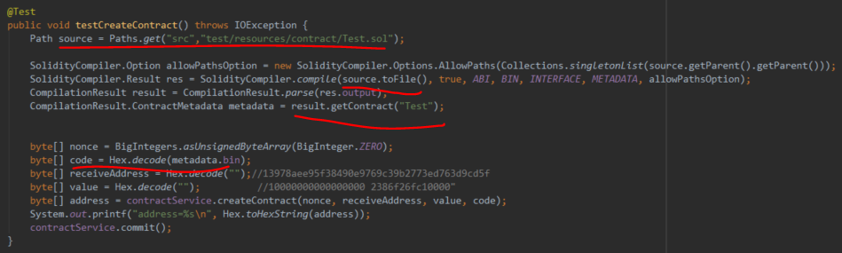
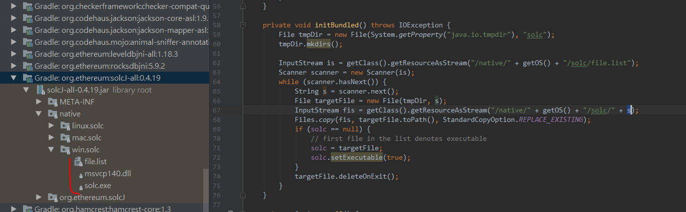
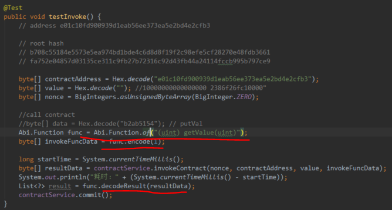
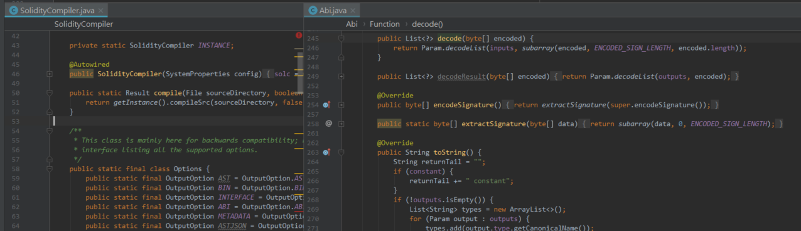

# 以太坊：Java代码调用Solidity编译器

**欢迎转载，但须指明出处：**[https://github.com/chenjw13097/papers](https://github.com/chenjw13097/papers/blob/master/%E5%8C%BA%E5%9D%97%E9%93%BE/%E4%BB%A5%E5%A4%AA%E5%9D%8A%EF%BC%9AJava%E4%BB%A3%E7%A0%81%E8%B0%83%E7%94%A8Solidity%E7%BC%96%E8%AF%91%E5%99%A8/%E4%BB%A5%E5%A4%AA%E5%9D%8A%EF%BC%9AJava%E4%BB%A3%E7%A0%81%E8%B0%83%E7%94%A8Solidity%E7%BC%96%E8%AF%91%E5%99%A8.md)  
  
定义一个合约，放到文件Test.sol中：  
  
  
Java程序通过调用solc.exe，对源码进行编译（当然编译前可以指定生成哪些信息，包括元信息），编译后可以得到字节码，可以用来部署。  
  
编译器是放在jar包中的（前提是调用class.getResourceAsStream所在类所在模块pom文件中引入了该jar包的依赖）：  
  
  
对于程序调用，则根据合约方法签名（类型信息还是用智能合约的），然后编码具体的参数，最后执行得到结果，通过这个解析，得到的是Java类型的List<?>，合约方法返回多少个值，List就有几个。这背后，有Java类型和Solidity类型的转换规则。  
  
  
  
总之，Remix上能得到的信息，通过内置的编译器也可以得到，需要哪些信息时，可以再细细探测研究。  
