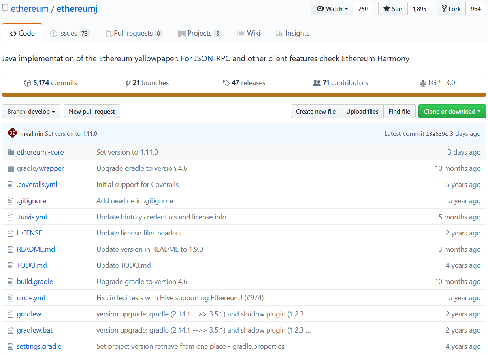
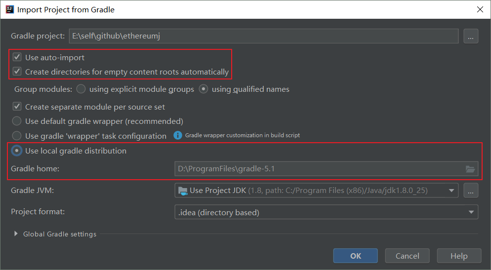
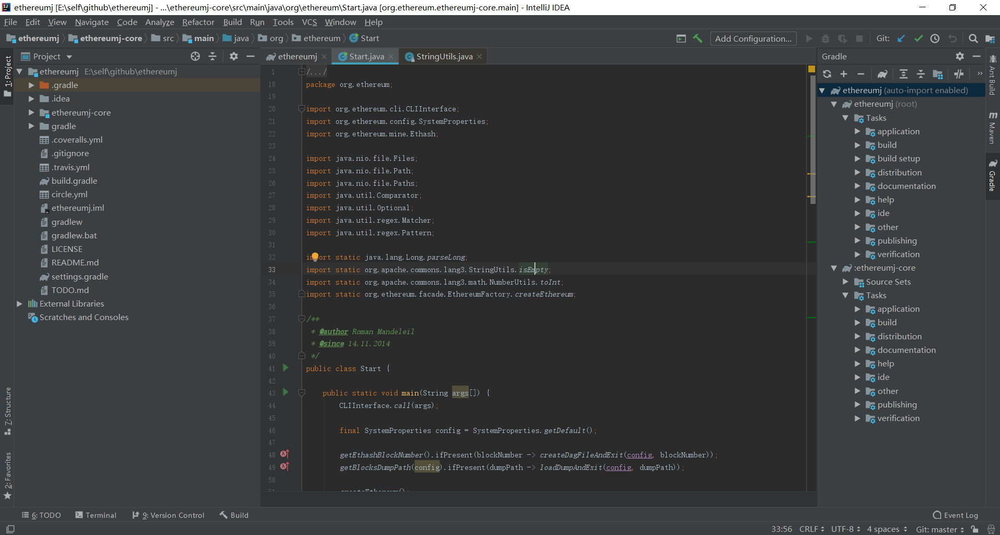
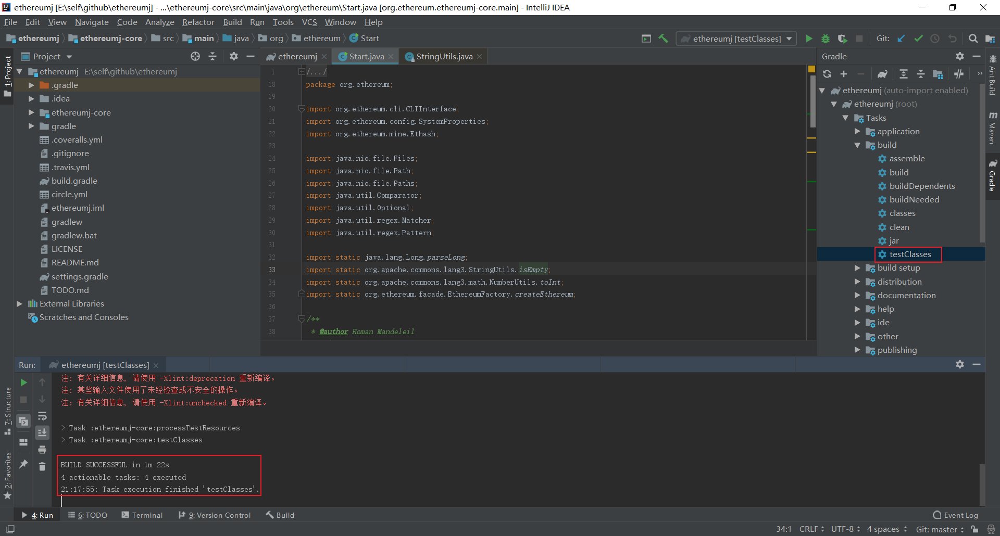

# 以太坊：Java语言版源码解读准备

### 链接

[https://github.com/ethereum/ethereumj](https://github.com/ethereum/ethereumj)  
此项目名为EthereumJ，是以太坊黄皮书的Java实现。  

### 下载

笔者使用Git克隆了master分支到本地。  
  

### IntelliJ IDEA打开

为了打开源码，需要事先安装[Gradle](../../软件或工具/Gradle环境搭建/Gradle环境搭建.md)和Git，并配置它们的环境变量。  
  
使用IntelliJ IDEA打开./build.gradle。  
  
  
第一次打开比较耗时，会自动下载需要的包，如下代码跳转正常。  
  
  
运行编译和测试也通过。  
  
  
如果读者不习惯Gradle，可以将配置文件.\ethereumj-core\build.gradle转换为POM文件，从而使用Maven构建工具来操作并顺利阅读代码。  
