# 以太坊：事件、日志和布隆过滤器  

**欢迎转载，但须指明出处：**[https://github.com/chenjw13097/papers](https://github.com/chenjw13097/papers/blob/master/%E5%8C%BA%E5%9D%97%E9%93%BE/%E4%BB%A5%E5%A4%AA%E5%9D%8A%EF%BC%9A%E4%BA%8B%E4%BB%B6%E3%80%81%E6%97%A5%E5%BF%97%E5%92%8C%E5%B8%83%E9%9A%86%E8%BF%87%E6%BB%A4%E5%99%A8/%E4%BB%A5%E5%A4%AA%E5%9D%8A%EF%BC%9A%E4%BA%8B%E4%BB%B6%E3%80%81%E6%97%A5%E5%BF%97%E5%92%8C%E5%B8%83%E9%9A%86%E8%BF%87%E6%BB%A4%E5%99%A8.md)    
    
### Solidity中的事件在Java中被记录为日志  

#### 包含事件定义和生成的Solidity源码  

包含事件定义和生成的Solidity源码： 
``` 
pragma solidity ^0.4.12;  
contract EventDemo {  
    event Sent(uint indexed value, address from, uint amount);  
    constructor () public {  
        emit Sent(25, msg.sender, 56);  
    }  
}  
```
事件的参数可用indexed标记，标记后就可以生成布隆过滤器，以便合约的事件查询。最多可以有3个indexed标记的参数，且indexed标记的参数必须在最前头。  
另外，因为主题都是一个个的32字节存储的，因而能作为indexed的不能是动态类型。  
  
编译后得到字节码：  
6080604052348015600f57600080fd5b50604080513381526038602082015281516019927f2e0c9b7721d4bcc1b5781e2248e010b07b94a614f855a3406b43d03aad9ad4d2928290030190a260358060586000396000f3006080604052600080fd00a165627a7a72305820a916c71db2597b4b3d7c2a8311ac8bc79e96edb3187542cd0d464813a12dd2600029  
  
对应的汇编代码：  
PUSH1 0x80 PUSH1 0x40 MSTORE CALLVALUE DUP1 ISZERO PUSH1 0xF JUMPI PUSH1 0x0 DUP1 REVERT JUMPDEST POP PUSH1 0x40 DUP1 MLOAD CALLER DUP2 MSTORE PUSH1 0x38 PUSH1 0x20 DUP3 ADD MSTORE DUP2 MLOAD PUSH1 0x19 SWAP3 PUSH32 0x2E0C9B7721D4BCC1B5781E2248E010B07B94A614F855A3406B43D03AAD9AD4D2 SWAP3 DUP3 SWAP1 SUB ADD SWAP1 LOG2 PUSH1 0x35 DUP1 PUSH1 0x58 PUSH1 0x0 CODECOPY PUSH1 0x0 RETURN STOP PUSH1 0x80 PUSH1 0x40 MSTORE PUSH1 0x0 DUP1 REVERT STOP LOG1 PUSH6 0x627A7A723058 KECCAK256 0xa9 AND 0xc7 SAR 0xb2 MSIZE PUSH28 0x4B3D7C2A8311AC8BC79E96EDB3187542CD0D464813A12DD260002900  
  
应用二进制接口的JSON表示，包含了构造方法和事件的定义：  
```
[  
        {  
                &quot;inputs&quot;: [],  
                &quot;payable&quot;: false,  
                &quot;stateMutability&quot;: &quot;nonpayable&quot;,  
                &quot;type&quot;: &quot;constructor&quot;  
        },  
        {  
                &quot;anonymous&quot;: false,  
                &quot;inputs&quot;: [  
                        {  
                                &quot;indexed&quot;: true,  
                                &quot;name&quot;: &quot;value&quot;,  
                                &quot;type&quot;: &quot;uint256&quot;  
                        },  
                        {  
                                &quot;indexed&quot;: false,  
                                &quot;name&quot;: &quot;from&quot;,  
                                &quot;type&quot;: &quot;address&quot;  
                        },  
                        {  
                                &quot;indexed&quot;: false,  
                                &quot;name&quot;: &quot;amount&quot;,  
                                &quot;type&quot;: &quot;uint256&quot;  
                        }  
                ],  
                &quot;name&quot;: &quot;Sent&quot;,  
                &quot;type&quot;: &quot;event&quot;  
        }  
]  
```

#### 执行合约得到日志  

在以太坊上执行上面的合约字节码：  
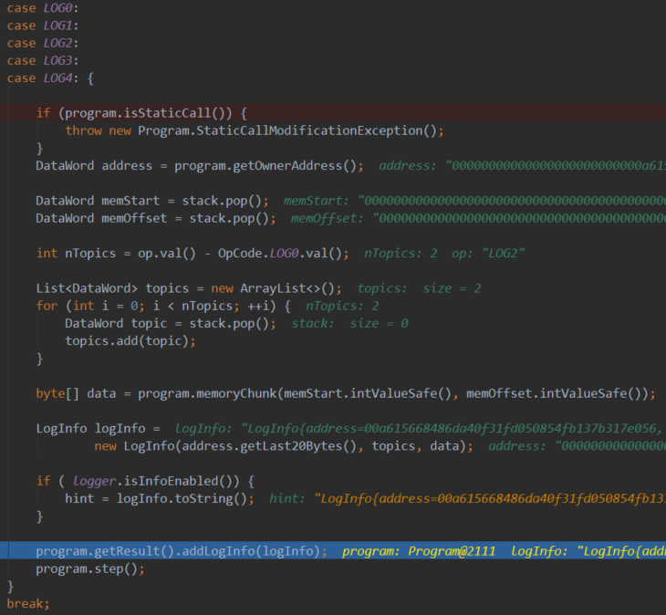  
  
日志信息通过LogInfo类记录：  
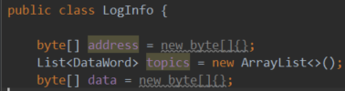  
LogInfo{address=00a615668486da40f31fd050854fb137b317e056, topics=[2e0c9b7721d4bcc1b5781e2248e010b07b94a614f855a3406b43d03aad9ad4d2 0000000000000000000000000000000000000000000000000000000000000019], data=00000000000000000000000005792f204d45f061a5b68847534b428a127ae5830000000000000000000000000000000000000000000000000000000000000038}  
address记录事件生成所在的合约地址。  
topics记录主题列表，第一个是事件签名的SHA3编码，编译时就定了，使用了计算公式keccak256(&quot;Sent(unit,address,uint)&quot;)。接下来的主题，则分别对应了indexed的参数值，如这里的value的25。  
data记录没有indexed标记的参数值，如这里的from和amount的值。  
  
LOGn，其中n为0\~4，表示的是主题数量，如上面使用了LOG2，表示有两个主题，一个是事件签名的SHA3编码，一个是indexed修饰的参数。  

#### 日志信息的解析  

##### 通过ABI解析  

可以看到，日志信息存放的数据并非直接可读的，所以需要解析，方法如下：  
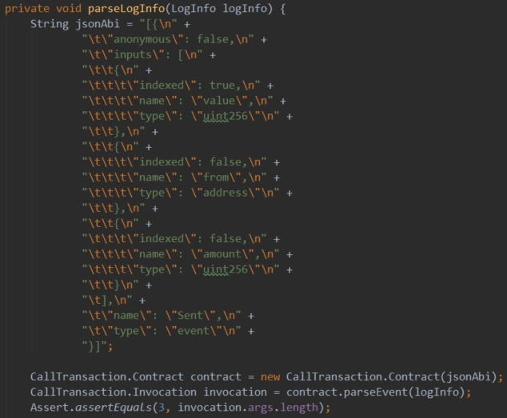  
注意，这里的JSON按解析的要求使用的是数组形式，只是我们只传递了一个事件的ABI。  
  
得到的结果如下，即args为事件参数值：  
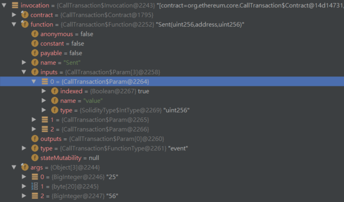  
记下来分析下解析过程。 
   
1）通过ABI的JSON表示得到对应的Function[]实例。  
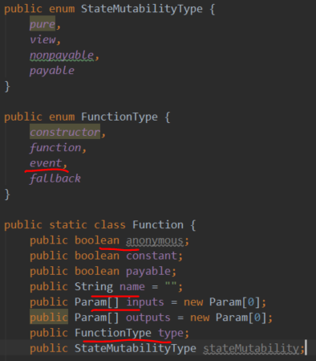  
这个Function[]实现时Contract的一个字段。  
  
2）根据日志信息的第一个主题得到对应的事件的Function。  
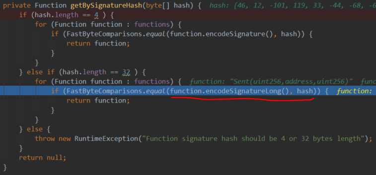  
可以看到，其过程是拿出合约的Function[]中的每一个，计算出签名的SHA3值与日志信息的第一个主题比较，如果相等就筛除了此Function。  
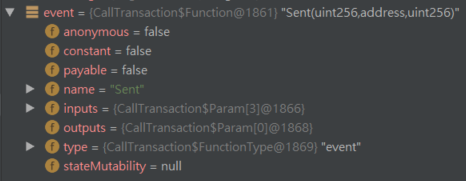  
  
从这里也可以看出事件签名SHA3在Java上是如何等价实现的，即用到了事件名和参数类型来获取签名，没有用到事件的其他组成。  
  
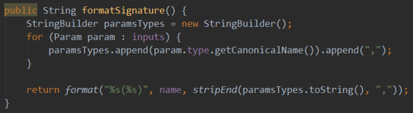  
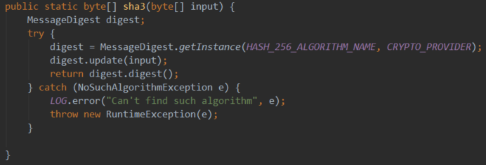  
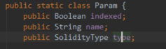  
  
3）根据事件的Function，解析主题列表和日志信息的data部分。  
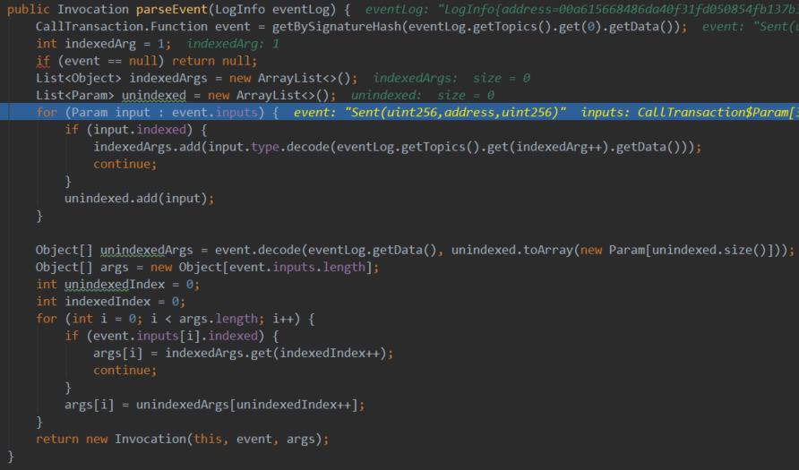  
对应主题的解析，则直接使用SolidityType解析其类型值，如例子中的value：  
org.ethereum.solidity.SolidityType.IntType#decode  
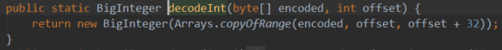  
对于未indexed的参数，则可能包含动态类型，解析过程如下：  
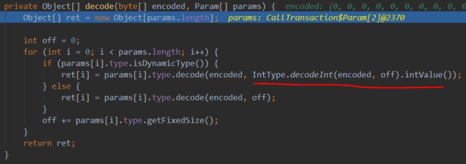  
可以看到data部分是每个非indexed参数各自ABI编码后的简单拼接，与合约调用时需要所有参数整体ABI编码是不同的。  

##### 通过事件签名解析  

```java
public static class Event extends Entry {  
    private static final Pattern _EVENT\_SIGNATURE_ = Pattern._compile_(&quot;^(\\w+?)\\((.+?)\\)$&quot;);  
    private static final String _PARAMETER\_TYPE\_SEPARATOR_ = &quot;,&quot;;  
    private static final String _INDEXED\_SEPARATOR_ = &quot; &quot;;  

    _/\*\*  
     \* Add parsing event form signature.  
     \*  
     \*_ **@param** _signature_ _event signature  
     \*_ **@return** _Event instance  
     \*/  
    _ public static Event fromSignature(String signature) {  
        Matcher matcher = _EVENT\_SIGNATURE_.matcher(signature);  
        if (!matcher.find()) {  
            throw new IllegalArgumentException(&quot;Event signature is illegal&quot;);  
        }  

        String params = matcher.group(2).trim();  
        if (StringUtils._isEmpty_(params)) {  
            throw new IllegalArgumentException(&quot;Event parameter list cannot be empty&quot;);  
        }  
        if (params.startsWith(_PARAMETER\_TYPE\_SEPARATOR_) || params.endsWith(_PARAMETER\_TYPE\_SEPARATOR_)) {  
            throw new IllegalArgumentException(  
                    String._format_(&quot;Event signature can not begin or end with %s&quot;, _PARAMETER\_TYPE\_SEPARATOR_));  
        }  

        String eventName = matcher.group(1).trim();  
        List<Param> eventInputs = new ArrayList<>();  
        boolean indexedOver = false;  
        for (String paramType : params.split(_PARAMETER\_TYPE\_SEPARATOR_)) {  
            String[] paramPart = paramType.split(_INDEXED\_SEPARATOR_);  
            Param param = new Param();  
            if (paramPart.length == 1) {  
                param.type = SolidityType._getType_(paramPart[0]);  
                param.indexed = false;  
                indexedOver = true;  
            } else if (paramPart.length == 2 &amp;&amp; !indexedOver) {  
                param.type = SolidityType._getType_(paramPart[0]);  
                param.indexed = true;  
            } else {  
                throw new IllegalArgumentException(  
                        String._format_(&quot;Event parameter \&quot;%s\&quot; is illegal&quot;, paramType));  
            }  
            eventInputs.add(param);  
        }  

        return new Event(false, eventName, eventInputs, null);  
    }  
```
  
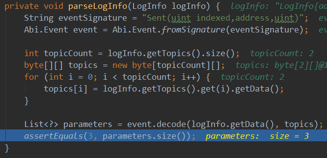  
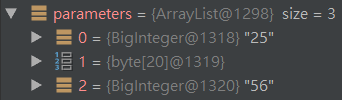  

### 布隆过滤器的应用  

#### 布隆过滤器的简介  

在存储一个数据时，我们将来可能要查询它。为此，我们可以将此数据进行N个哈希函数计算，得到N个值。假设这些数均匀分布在M以内，那么可以设置一个长度为M的位向量，根据得到的N个值，将位向量上对应的N个位置的为置为1。这就得到了一个布隆过滤器。对所有的数据都这样，然后合并到这个布隆过滤器上。  
  
要判断一个数据是否存储过，则也计算出这N个值，然后看布隆过滤器位向量相应位置是否都为1，如果不是，则一定没有存储过，否则可能存储过（之所以是可能，因为不同的数据可能覆盖位向量的同一位）。如果全为1，则再进行数据的具体比对。  
  
可以看到，这可以大大加速数据的查找，它可以快速排出未存储的数据。  

#### 为一个事件生成布隆过滤器  

为一个事件，或者说一条日志，生成布隆过滤器的过程如下：  
org.ethereum.vm.LogInfo#getBloom  
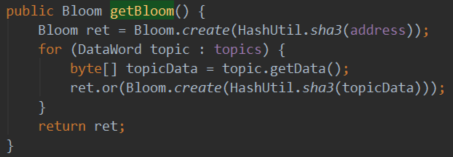  
  
也就是说，将参与布隆过滤器生成的合约地址和各个主题，分别进行SHA3编码，得到一个个32字节的哈希值。然后将根据这些哈希值生成的布隆过滤器合并就得到了事件的布隆过滤器。  
  
根据哈希值生成布隆过滤器的过程是：  
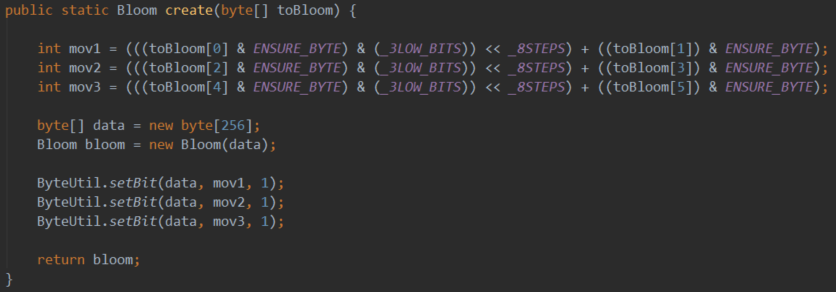  
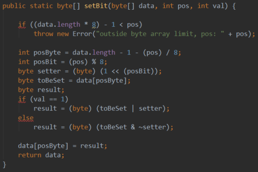  
将布隆过滤器内部存储的位向量设置为2048位，即256字节。  
取第0字节的低3位和第1字节组成int值b，它的最大值为2047，布隆过滤器位向量的第b位设置为1。  
同理，取第2、3字节，取4、5字节，填充布隆过滤器位向量的指定位。  
  
布隆过滤器的合并操作如下：  
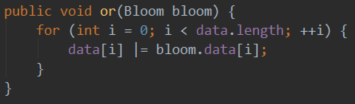  
即将布隆过滤器的位向量同样的位做或运算。  
  
从上面的过程可知，一个事件因为最多4个主题，一个主题最多会设置3个位，所以一个事件在布隆过滤器中最多占据位向量2048位中的12位。  

#### 为一个交易生成布隆过滤器  

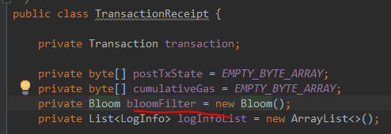  
默认使用256字节的位向量。  
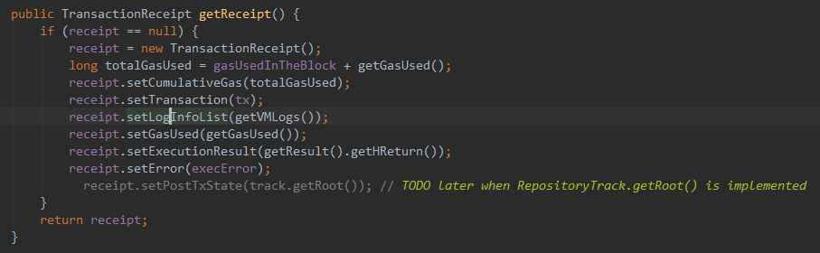  
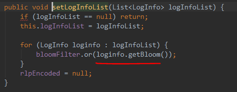  
交易的布隆过滤器是所有的事件布隆过滤器的合并。  

#### 为一个区块生成布隆过滤器  

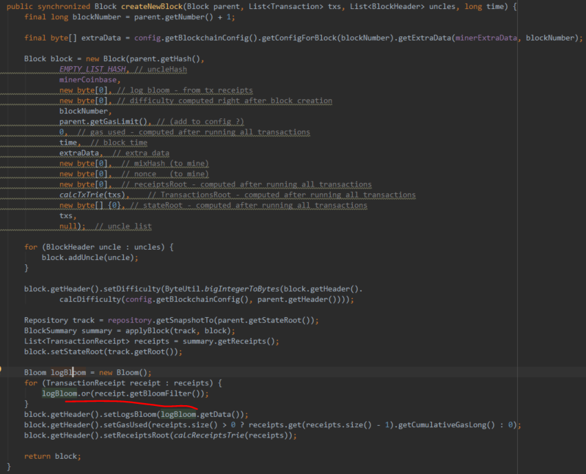  
区块的布隆过滤器是所有的交易隆过滤器的合并，最后区块的布隆过滤器存放在区块头。  

#### 事件查询  

使用布隆过滤器可以大大加速事件的查询。我们知道，以太坊会先创建各个主题的布隆过滤器，然后合并得到事件的布隆过滤器，再合并得到交易的布隆过滤器，最后合并得到区块的布隆过滤器。而查询满足指定特征的事件的过程则正好相反，即先根据查询条件得到布隆过滤器，如果其位向量是区块布隆过滤器的子向量，则认为可能在此区块有，如果不是则就能判断不是了，如果是有可能，则继续对比区块下各个交易的布隆过滤器，以此类推。最后如果匹配事件的布隆过滤器，则在进行严格的数据验证，验证相同则通过了。  
  
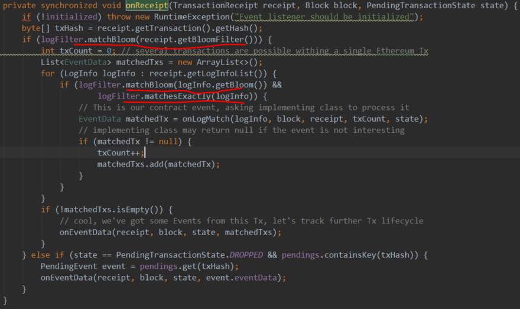  
这里只展示了从交易的布隆过滤器开始查询。  
  
如果事件的某个字段能够作为查询条件，那么它应该定义为indexed。  
  
下面看看以太坊的一个实现：布隆匹配的最终目标是日志信息，终极匹配为事件布隆过滤器的匹配。  
1）布隆过滤器匹配。  
org.ethereum.core.Bloom#matches  
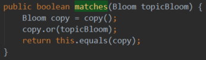  
参数为传进来的日志特征，如果它是本布隆过滤器的子布隆过滤器，则返回true。  
2）提供给外部的查询参数。  
org.ethereum.listener.LogFilter  
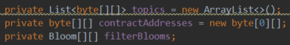  
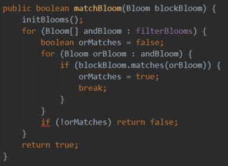  
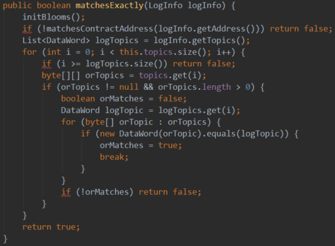  
外界如何表达自己的查询要求？  
- 要查询合约A内包含有主题a、b、c的事件，其布隆过滤器匹配过程要求的传入是：  
contractAddresses.length=1。  
contractAddresses[0]=A。  
topics.size=3。  
topic.get(0)=byte[][]，其中byte[][]可以有多个值，表示任何一个值满足，那么该主题都是值满足的，其他主题同理。  
A、a、b、c要同时存在且值满足，则对应的日志信息是匹配的，就可以进入精确比对了，比对过则返回给查询者。  
- 如果要查询的是多个合约含这些主题的事件，则contractAddresses.length相应变化且传入值即可。  
  
总之，对于是否匹配合约、指定主题则必须全满足，而具体到某一个，则值中的任意一个匹配上就满足了。  
