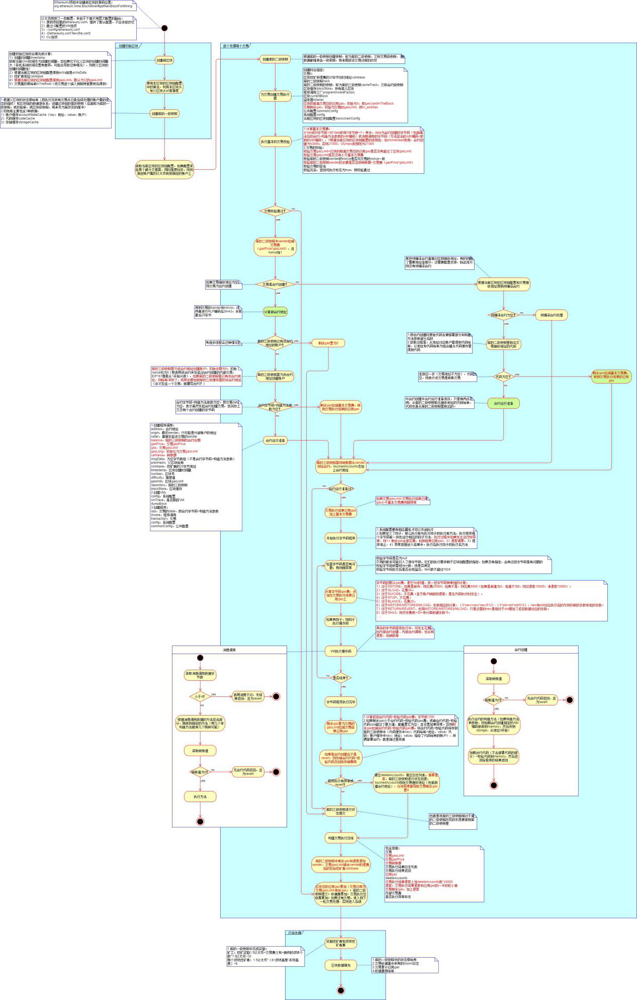
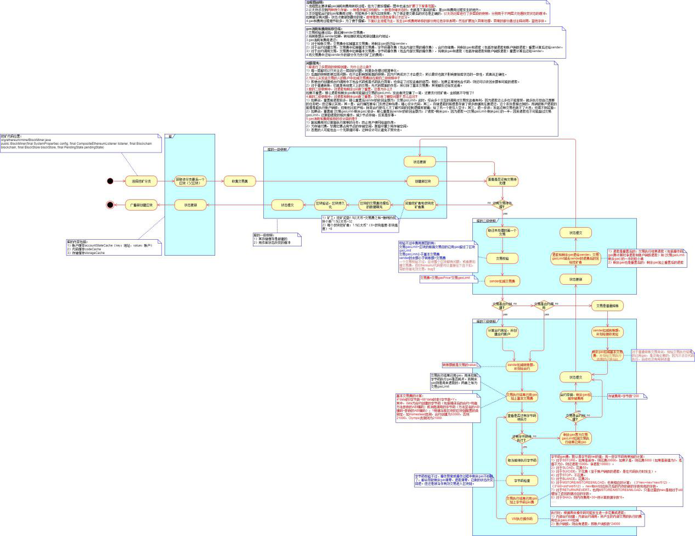

# 以太坊：区块处理流程

### 节点创建新区块的处理过程

见源码org.ethereum.mine.BlockMiner#BlockMiner。  
  
1）事先，试执行过的交易会进入到缓存。  
2）对这些交易按nonce和hash排序，并移除掉那些gasLimit不达配置的交易。  
3）获取叔块。  
  
4）根据父最优区块、交易列表和叔区块列表创建初始区块。  
**区块时间戳**  
在区块头。当前UNIX时间（当前毫秒数除以1000）。如果当前获得的该时间不大于父区块时间戳，则应该为父区块时间戳加一。  
**额外数据**  
在区块头。从配置而来。  
**区块挖矿地址**  
在区块头。从配置而来，是20字节的地址。  
**区块gasLimit**  
在区块头。等于父区块的gasLimit。  
**交易列表的根哈希**  
在区块头。使用MPT计算交易列表的根哈希。  
**叔区块列表哈希**  
叔区块列表的SHA3编码。  
**区块难度**  
在区块头。由父区块头和当前区块头（计算前难度为0）计算而来。  
5）根据父区块的状态根哈希创建初始库，然后处理区块并返回区块总结。  
6）根据区块总结，回填部分区块数据字段：区块执行后的初始库的根哈希填充状态根哈希，根据交易回执列表中的各个布隆过滤器得到区块的日志布隆，根据最后一个交易回执得到累积已用的gas数量，计算出交易回执列表的根哈希。  
  
7）一旦得到区块，就放到参与世界挖矿的节点执行，如果是在最优链上的，这个节点上执行后，则广播出去。  
  
创建新区块流程如下。  
  

### 节点接收到广播区块的处理过程

见源码org.ethereum.manager.BlockLoader#blockWork。  
  
1）接收到其他节点广播来的区块。  
2）检查其区块头。  
3）检查其是否已经在区块缓存里有了，有则返回。  
4）检查其父是否已经有了，有则继续。  
  
5）检查交易根哈希是否就是交易列表对应的MPT根哈希。  
6）检查所有交易的发送者nonce是否合规，除了与库一致，还要在列表内是合规的。  
  
7）读取库当前的根哈希，保留后用。  
8）开始执行区块，即逐条处理每条交易。  
9）根据库（区块级快照）创建交易级快照。  
10）根据交易级快照创建合约级快照。  
11）执行交易，这个过程中涉及到如检查交易gasLimit累计是否可能超过区块gasLimit，交易执行中gas是否足够，nonce是否符合及递增，余额是否足够及转账，创建合约，改变合约状态，保存合约代码，改变账户的状态等等。  
12）执行交易完成后，提交合约级快照的状态改变刷到交易级快照。  
13）整理交易执行结果，将退款和费用分别转给发送者和矿工，删除需要删除的账户。  
14）提交交易级快照的状态改变刷到区块级快照。  
15）将交易执行结果和收据添加到列表。  
16）所有交易执行完毕后，计算对矿工和其他的奖励，至此区块执行完毕。  
  
17）根据交易收据列表计算得到MTP根哈希，检查与广播区块的是否一致。  
18）根据交易收据列表里的布隆过滤器计算区块的布隆过滤器值，检查与广播区块的是否一致。  
19）获取库此时的根哈希，检查与广播区块的是否一致。如果不一致，则执行过程与其他节点不一致，就是共识未达成。库的状态恢复为区块执行前的，之前保留的根哈希用上了。若一致就提交，也就是将数据刷到数据库。  
20）接着将区块及难度及是否分叉、交易序号及区块哈希及收据持久化，并重置最优区块，重置库的根哈希为该区块上的根哈希。  
  
21）上面处理过程中，对待最优链处理和分叉情况稍有不同。完成后，接下来就是处理分叉，省略。  

### Gas消耗和费用转移过程

  
