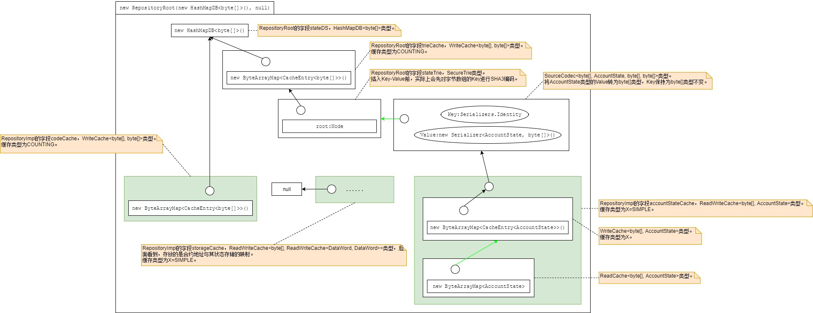
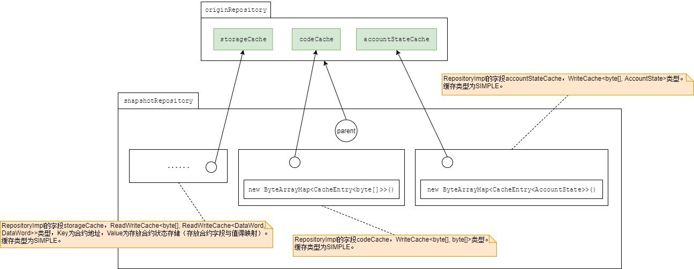
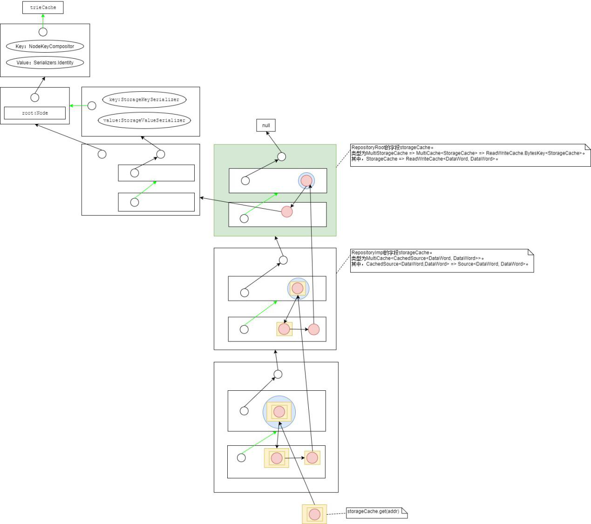
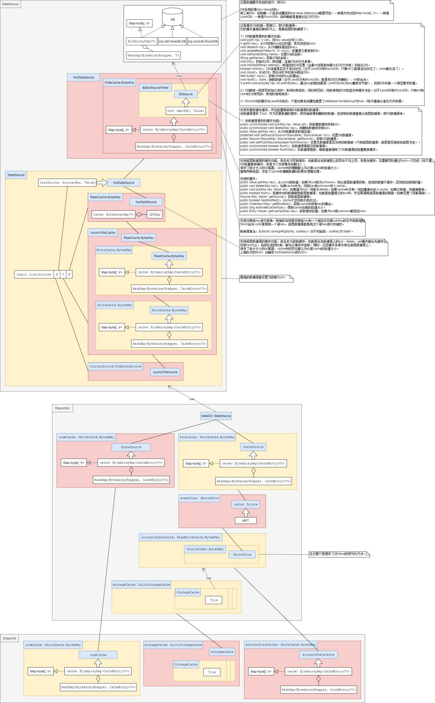

# 以太坊：合约事务性提交设计

### 创建起始库

这里假设数据库用的是HashMapDB。  
  

### 在起始库上创建账户、加钱并提交

在起始库上为指定的地址创建账户：  
1）创建一个新账户。  
2）将地址账户映射插入起始库的accountStateCache。  
3）首先放到读缓存里。  
4）然后再放到写缓存里，账户被封装为简单缓存实体。  
  
接着，给该账户加钱：  
1）首先从起始库的accountStateCache的读缓存中读取到对应地址的账户。  
2）接着，以该账户为基础创建新的账户，钱为原来的与新加的之和。  
3）使用新账户覆盖读缓存里的旧账户。  
4）使用新账户覆盖写缓存里的旧账户。  
  
最后，初始库提交：  
1）锁定该库，即只让一个线程操作。  
2）刷新storageCache，因为其写缓存为空，即没有任何合约状态的存储，无可刷的数据，直接返回。  
3）刷新codeCache，也因为其写缓存为空，无可刷的数据，直接返回。  
4）刷新accountStateCache，其写缓存有一条地址账户映射数据，将该数据经过编码器，其的Key即地址，仍旧保留为字节数组，而数据的Value即账户使用RLP编码得到字节数组，然后用此都为字节数组的Key-Value插入MPT（因为是SecureTrieste，插入前Key经过SHA3编码），并清空写缓存。  
5）解锁该库。  
6）刷新MPT，即对MPT进行编码，编码后会将根哈希和其RLP编码的映射写到缓存中，其根也重置为无子孙结点，其哈希为刚得到的根哈希。  
7）刷新MPT的缓存，即将MPT的缓存（为一写缓存）里的数据（MPT根哈希和其RLP编码的映射），直接写到HashMapDB<byte[], byte[]>去，且该写缓存的数据清空。  

### 为库创建快照

  

### 部署合约

1）为初始库（区块级快照）创建快照（交易级快照）。  
2）为交易级快照创建快照（合约级快照）。  
  
3）检查交易nonce是否与库里账户当前的nonce一致，获取后者的过程如下：  
A.根据发送者地址，从交易级快照获取。  
B.从写缓存accountStateCache读取，发现没有，然后就从上一级库即区块级快照的accountStateCache（为读写缓存）获取。  
C.从读缓存里直接获得对应的账户。  
D.从该账户得到nonce。  
4）检查待部署的合约地址是否有账户存在，应该不存在，过程如下：  
A.从合约级缓存读取，但直到区块级快照accountStateCache（为读写缓存）的读缓存里也没有。  
B.接着从accountStateCache的写缓存中读取，但写缓存没有，所以从它的底层数据源获取，即经过编码器获取，后者直接调用MPT（SecureTrie）获取，即先将Key进行SHA3编码，然后在树上查找。树上查找过程中，会根据根结点哈希，从底层查出对应的RLP编码值，由此解析出结点逐步查找，最后查找不到。  
C.然后逐步返回来，中途会在区块级快照的读缓存缓存对应的合约地址上的账户为空，用了一个NULL对象表示（实际上是一个new Object()，这是一个关于NULL妙用的地方）。  
5）检查待部署的合约地址是否有代码存在，应该不存在，过程如下：  
从交易级快照里进行。同步骤4），但因为步骤4）缓存了账户为NULL，此时得到了，所以知道账户不存在，直接就返回空字节数组的代码。  
  
6）接下来，仍是在交易级快照里，增加nonce：  
A.最终从初始库的读缓存里得到了对应发送者地址的账户（可见几级快照的读都是从区块级快照得到，得到后改变了，缓存在其他级里才在后续读取这些级里的，总之，其他级的只用来缓存写的和改变的部分）。  
B.以此账户为基准，创建一个新账户，nonce是加一的。  
C.将此地址账户映射存放在交易级快照里的accountStateCache写缓存。  
  
7）在合约级快照里，为新的合约地址创建账户：  
直接创建一个账户，并将地址账户映射存放到合约级快照里的accountStateCache写缓存。  
8）在合约级快照里，从发送者账户转账到合约：  
A.发送者的账户缓存在交易级快照的写缓存里（前面有在交易级快照为账户的nonce加一），读取后从里面扣减余额并生成新账户，然后地址新账户存入合约级快照的写缓存里。即此时，发送者账户在交易级快照和合约级快照同时存在，在合约级是最新的。  
B.合约账户缓存在合约级快照里，读取后从里面增加余额并生成新账户，然后地址新账户覆盖合约级快照里原有的。  
9）创建程序的存储：存储的地址是合约地址，库使用合约级快照。  
  
10）执行合约过程中，初始化方法里有设置一个字段的值，所以会碰到SSTORE指令，该指令也需要进行gas的计算，此时会查看字段的原有值（哪怕第一次），会触发合约状态存储的分配，即StorageCache的创建：  
A.直接从合约级快照根据合约地址得到账户。  
B.发现合约账户不为空，接着就从合约级快照storageCache（读写缓存，这里不但写缓存，还读缓存，主要是为了加快合约执行，合约里会频繁涉及合约状态的读取）里获取指定合约地址的合约状态存储，发现读缓存无，写缓存无。往前，交易级快照storageCache读写缓存也没有。往前，区块级快照的storageCache读写缓存也没有。  
C.于是在区块级快照创建。先在区块级快照里获取该地址的账户，发现为NULL（在合约级快照中的账户还没有提交到区块级快照来）。  
D.将合约地址转换为32字节，就是对Key做转换，即编码器对Key，不对Value。  
E.使用区块级快照的trieCache为其编码器的底层数据源。  
F.创建MPT，其缓存用上面的编码器，对应的树的根哈希用账户的合约状态根哈希，但如果是新建账户，在区块级是没有的，此时根哈希为空。  
G.在此MPT上，有另一层编码器，以此MPT为底层数据源，Key和Value都是DataWord类型，对Key，则就是DataWord与byte[]的简单转换，对Value，则是对去掉前导零后的RLP编码，以及RLP解码后得到DataWord。  
H.在此编码器上再封装为StorageCache，它是ReadWriteCache<DataWord, DataWord>的子类，如此看来它与存储账户的结构也是类似的了。  
I.将此StorageCache与合约地址的映射缓存起来（在区块级快照创建时就有的storageCache对象里，它是读写缓存），读缓存和写缓存都存了。至此，之前storageCache底层数据源为null也有变为有值了，而且与最初的trieCache也连通了（见创建起始库的图）。  
J.然后，逐级以此存储传递给交易级快照、合约级快照，但均封装为写缓存，然后该写缓存又都封装到读写缓存，读缓存和写缓存都存了此写缓存。  
K.然后获取对应的值，依旧是从合约级快照开始，向源快照方向逐层从写缓存获取、区块级写缓存还是获取不到，则从MPT树上获取了。  
11）SSTRE指令执行时，会将字段的值保存到合约状态存储里去：  
A.从部署的完整代码取出值，字节码给该字段定义了Key值，然后将此Key-Value存到存储里。  
B.首先看合约级快照，如果没有合约地址对应的账户则先创建一个。  
C.从合约级快照的storageCache，将Key-Value写入合约地址对应读写缓存。在存储时，就是存储在写缓存上。并不存到MPT上，只有提交快照时才逐层提交到写缓存，区块级快照提交时才开始写到MPT上。  
  
12）合约执行完毕，合约级快照里，将存储代码存放到合约地址：  
A.存储代码的SHA3编码和地址共同组成Key，存储代码为Value，将Key-Value存入codeCache。  
B.并将合约账户的代码哈希置为刚才计算得到的。  
13）如果合约是正常执行完的，则提交合约级快照里的数据：  
A.锁定父的交易级快照。  
B.提交到交易级快照里的同等位置处。  
14）决定是否删除某些账户后，继续提交交易级快照里的数据，提交到区块级快照的同等位置处。  
15）获取区块级快照的根哈希：  
A.将storageCache的数据刷到底层：将合约数据刷到MPT上，编码MPT，会将数据编码写到MPT的缓存（存到此缓存的数据是根哈希与合约状态的RLP编码），并将得到的根哈希付给合约账户。  
B.将accountStateCache的数据刷到底层，即刷到MPT上。  
C.编码MPT，获取此时的MPT的根哈希，即为此时区块级快照的根哈希。  
16）最后只有提交区块级快照，那么MPT缓存的数据才会持久化到DB。  

### 获取合约对应的合约状态存储

1）首先在合约级快照里读取：  
读缓存（实体封装）->写缓存（本身就已实体封装）->读缓存->写缓存（本身就已实体封装）->底层数据源，即交易级快照。  
2）其次在交易级快照里读取：  
读缓存（实体封装）->写缓存（本身就已实体封装）->读缓存->写缓存（本身就已实体封装）->底层数据源，即区块级快照。  
3）最后在区块级快照里读取：  
读缓存（实体封装）->写缓存（本身就已实体封装）->发现没有，创建合约状态存储。  
4）创建合约状态存储，类型为StorageCache。  
5）将合约地址和StorageCache的映射存放到区块级快照：读缓存->写缓存（实体封装）。  
6）继续存到交易级读缓存。  
……  
最终得到的是StorageCache（合约状态存储）的双层WriteCache封装。  
  

### 合约级快照保存合约状态

在合约级快照，得到StorageCache的双层WriteCache封装。  
将合约字段和值存入外层WriteCache。  

### 合约级快照提交

在合约级快照，根据合约地址，得到StorageCache的双层WriteCache封装。  
将外层WriteCache中的合约Key-Value，刷到里层WriteCache，即进入到交易级快照。  
交易级快照提交类似，提交到区块级快照的写缓存里。  

### 区块级快照storageCache的刷新

根据合约地址得到StorageCache，里面有从交易级快照刷过来的合约字段值。  
然后将合约字段值刷到MPT上。  
将MPT的数据刷到底层去，也就是起始库的trieCache上。  
将MPT的根哈希存到合约账户里去。  

### 区块级快照accountStateCache的刷新

将账户刷到MPT上。但不像合约字段值，马上编码刷到trieCache上，而是调用MPT获取根或刷新MPT时才刷到trieCache。  
而trieCache得刷新则最终进入DB。  

## 总结：通过多级快照完成合约执行的事务提交

除了区块外，以太坊中数据库要存储的数据主要包含3种：合约的状态、合约代码、账户。它们存储在Key-Value型的数据库中。  
1）为了能存储到Key-Value型数据库（SourceA），数据都组织为Key-Value形式，而以太坊中Key和Value都是字节数组。  
2）为了能配合LevelDB、RocksDB批量更新操作特性，在它上面封装了批量更新操作（SourceB）。在此基础上，又继续封装了批量缓存（SourceC），以便在需要时一次刷新到数据库中。  
3）上面的SourceC封装为WriteCache，就成了trieCache（SourceD）。  
4）SourceD作为MPT（SourceE）的缓存，而在此基础上涉及到Key的转换，就另一个数据源，实际上只是一个编码器（SourceF），数据进入编码器会自动刷到MPT上。  
5）账户数据在一个读写缓存（SourceG）上进行，它就以此编码器为底层数据源。而合约代码在一个写缓存（SourceH）上，它的底层数据源是SourceC。合约状态也是一个读写缓存（SourceI），它的底层数据源在创建初始库时为空。  
6）在执行合约时，初始库也即区块级快照，在它基础上创建交易级快照，在交易级快照上创建合约级快照。创建快照时，3种数据都被再次封装，账户数据被写缓存封装，合约代码被写缓存封装，合约状态被读写缓存封装。  
7）每一级快照上的更新都存放在该级的写缓存上。特别提下的是，在涉及合约字段操作时，会获取对应的合约状态存储，如果没有，则在区块级创建，创建的同时它的缓存最终也连接到trieCache上，也就是说与账户的数据最终刷到这里来。  
8）快照新变更数据是写在写缓存的，只有在发生提交时，才将写缓存一级级刷新到底层数据源。最后到区块级快照的写缓存中。  
9）当要获取区块级的根哈希时，会将合约状态刷到MPT上，也编码MPT，数据进入到trieCache，根哈希进入对应的合约账户，然后再将账户数据刷到MPT上。接着对MPT编码，数据进入到trieCache，然后就得到根哈希了。如果是提交数据，那么除了获取根哈希的这些过程，还会将合约代码刷到SourceC，trieCache的数据也刷到SourceC。最终进入到数据库。  
  
需要再说一点，SourceC（也就是stateSource）是数据库的封装了。测试时，可以将SourceC设置为内存的HashMapDB，但实际生产环境中，使用的是RocksDB或LevelDB，它的封装更复杂。  
  
综合来看，以太坊的数据源体系结构如下：  
  
