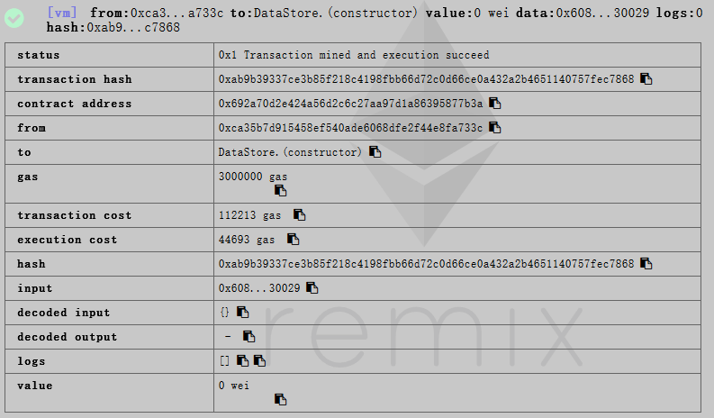

# 以太坊：在合约里调用指定地址的另一已部署合约

**欢迎转载，但须指明出处：**[https://github.com/chenjw13097/papers]()  

后面的讲解已在下面的在线IDE中验证过：  
[https://remix.ethereum.org/#optimize=false&amp;version=soljson-v0.4.25+commit.59dbf8f1.js](https://remix.ethereum.org/#optimize=false&amp;version=soljson-v0.4.25+commit.59dbf8f1.js)  

### 第一个合约：供调用的合约

编写源码：  
```
pragma solidity ^0.4.11;

contract DataStore {
    uint256 data;

    function set(uint256 x) public {
        data = x;
    }

    function get() public view returns (uint256) {
        return data;
    }
}
```

编译得到字节码：  
608060405234801561001057600080fd5b5060df8061001f6000396000f3006080604052600436106049576000357c0100000000000000000000000000000000000000000000000000000000900463ffffffff16806360fe47b114604e5780636d4ce63c146078575b600080fd5b348015605957600080fd5b5060766004803603810190808035906020019092919050505060a0565b005b348015608357600080fd5b50608a60aa565b6040518082815260200191505060405180910390f35b8060008190555050565b600080549050905600a165627a7a72305820d634a4ebf38b19ee1016c1c38741a0bb6d4a1cce390642adc3130c4067189db30029  

对应的汇编格式：  
PUSH1 0x80 PUSH1 0x40 MSTORE CALLVALUE DUP1 ISZERO PUSH2 0x10 JUMPI PUSH1 0x0 DUP1 REVERT JUMPDEST POP PUSH1 0xDF DUP1 PUSH2 0x1F PUSH1 0x0 CODECOPY PUSH1 0x0 RETURN STOP PUSH1 0x80 PUSH1 0x40 MSTORE PUSH1 0x4 CALLDATASIZE LT PUSH1 0x49 JUMPI PUSH1 0x0 CALLDATALOAD PUSH29 0x100000000000000000000000000000000000000000000000000000000 SWAP1 DIV PUSH4 0xFFFFFFFF AND DUP1 PUSH4 0x60FE47B1 EQ PUSH1 0x4E JUMPI DUP1 PUSH4 0x6D4CE63C EQ PUSH1 0x78 JUMPI JUMPDEST PUSH1 0x0 DUP1 REVERT JUMPDEST CALLVALUE DUP1 ISZERO PUSH1 0x59 JUMPI PUSH1 0x0 DUP1 REVERT JUMPDEST POP PUSH1 0x76 PUSH1 0x4 DUP1 CALLDATASIZE SUB DUP2 ADD SWAP1 DUP1 DUP1 CALLDATALOAD SWAP1 PUSH1 0x20 ADD SWAP1 SWAP3 SWAP2 SWAP1 POP POP POP PUSH1 0xA0 JUMP JUMPDEST STOP JUMPDEST CALLVALUE DUP1 ISZERO PUSH1 0x83 JUMPI PUSH1 0x0 DUP1 REVERT JUMPDEST POP PUSH1 0x8A PUSH1 0xAA JUMP JUMPDEST PUSH1 0x40 MLOAD DUP1 DUP3 DUP2 MSTORE PUSH1 0x20 ADD SWAP2 POP POP PUSH1 0x40 MLOAD DUP1 SWAP2 SUB SWAP1 RETURN JUMPDEST DUP1 PUSH1 0x0 DUP2 SWAP1 SSTORE POP POP JUMP JUMPDEST PUSH1 0x0 DUP1 SLOAD SWAP1 POP SWAP1 JUMP STOP LOG1 PUSH6 0x627A7A723058 KECCAK256 0xd6 CALLVALUE LOG4 0xeb RETURN DUP12 NOT 0xee LT AND 0xc1 0xc3 DUP8 COINBASE LOG0 0xbb PUSH14 0x4A1CCE390642ADC3130C4067189D 0xb3 STOP 0x29  

合约方法的ABI：  
```
{
    &quot;6d4ce63c&quot;: &quot;get()&quot;,
    &quot;60fe47b1&quot;: &quot;set(uint256)&quot;
}
```

方法的JSON表示：  
```
{
        &quot;constant&quot;: false,
        &quot;inputs&quot;: [
                {
                        &quot;name&quot;: &quot;x&quot;,
                        &quot;type&quot;: &quot;uint256&quot;
                }
        ],
        &quot;name&quot;: &quot;set&quot;,
        &quot;outputs&quot;: [],
        &quot;payable&quot;: false,
        &quot;stateMutability&quot;: &quot;nonpayable&quot;,
        &quot;type&quot;: &quot;function&quot;
}
```

部署：  
  
这里需要记住合约地址供后续调用：  
0x692a70d2e424a56d2c6c27aa97d1a86395877b3a  

### 第二个合约：调用已部署的第一个合约

编写源码：  
```
pragma solidity ^0.4.11;

contract DataStore {
    function set(uint256 x) public;
}

contract Caller {
    function call() public {
        address addr = 0x692a70d2e424a56d2c6c27aa97d1a86395877b3a;
        DataStore dataStore = DataStore(addr);
        dataStore.set(6);
    }
}
```
需要注意的是，这里需要提供一个已部署合约的接口，Caller是根据它的签名形式得到合约函数的编码的。当然用到哪些方法就声明哪些，不用全部都声明。  

编译得到字节码：  
608060405234801561001057600080fd5b50610132806100206000396000f300608060405260043610610041576000357c0100000000000000000000000000000000000000000000000000000000900463ffffffff16806328b5e32b14610046575b600080fd5b34801561005257600080fd5b5061005b61005d565b005b60008073692a70d2e424a56d2c6c27aa97d1a86395877b3a91508190508073ffffffffffffffffffffffffffffffffffffffff166360fe47b160066040518263ffffffff167c010000000000000000000000000000000000000000000000000000000002815260040180828152602001915050600060405180830381600087803b1580156100ea57600080fd5b505af11580156100fe573d6000803e3d6000fd5b5050505050505600a165627a7a7230582025c55475ae45e3db9b16ec482d7d151fb1755a1b5de54576f5f383beb40cb58f0029  

对应的汇编格式：  
PUSH1 0x80 PUSH1 0x40 MSTORE CALLVALUE DUP1 ISZERO PUSH2 0x10 JUMPI PUSH1 0x0 DUP1 REVERT JUMPDEST POP PUSH2 0x132 DUP1 PUSH2 0x20 PUSH1 0x0 CODECOPY PUSH1 0x0 RETURN STOP PUSH1 0x80 PUSH1 0x40 MSTORE PUSH1 0x4 CALLDATASIZE LT PUSH2 0x41 JUMPI PUSH1 0x0 CALLDATALOAD PUSH29 0x100000000000000000000000000000000000000000000000000000000 SWAP1 DIV PUSH4 0xFFFFFFFF AND DUP1 PUSH4 0x28B5E32B EQ PUSH2 0x46 JUMPI JUMPDEST PUSH1 0x0 DUP1 REVERT JUMPDEST CALLVALUE DUP1 ISZERO PUSH2 0x52 JUMPI PUSH1 0x0 DUP1 REVERT JUMPDEST POP PUSH2 0x5B PUSH2 0x5D JUMP JUMPDEST STOP JUMPDEST PUSH1 0x0 DUP1 PUSH20 0x692A70D2E424A56D2C6C27AA97D1A86395877B3A SWAP2 POP DUP2 SWAP1 POP DUP1 PUSH20 0xFFFFFFFFFFFFFFFFFFFFFFFFFFFFFFFFFFFFFFFF AND PUSH4 0x60FE47B1 PUSH1 0x6 PUSH1 0x40 MLOAD DUP3 PUSH4 0xFFFFFFFF AND PUSH29 0x100000000000000000000000000000000000000000000000000000000 MUL DUP2 MSTORE PUSH1 0x4 ADD DUP1 DUP3 DUP2 MSTORE PUSH1 0x20 ADD SWAP2 POP POP PUSH1 0x0 PUSH1 0x40 MLOAD DUP1 DUP4 SUB DUP2 PUSH1 0x0 DUP8 DUP1 EXTCODESIZE ISZERO DUP1 ISZERO PUSH2 0xEA JUMPI PUSH1 0x0 DUP1 REVERT JUMPDEST POP GAS CALL ISZERO DUP1 ISZERO PUSH2 0xFE JUMPI RETURNDATASIZE PUSH1 0x0 DUP1 RETURNDATACOPY RETURNDATASIZE PUSH1 0x0 REVERT JUMPDEST POP POP POP POP POP POP JUMP STOP LOG1 PUSH6 0x627A7A723058 KECCAK256 0x25 0xc5 SLOAD PUSH22 0xAE45E3DB9B16EC482D7D151FB1755A1B5DE54576F5F3 DUP4 0xbe 0xb4 0xc 0xb5 DUP16 STOP 0x29  

对应方法得ABI：  
```
{
    &quot;28b5e32b&quot;: &quot;call()&quot;
}
```
方法的JSON表示：  
```
{
        &quot;constant&quot;: false,
        &quot;inputs&quot;: [],
        &quot;name&quot;: &quot;call&quot;,
        &quot;outputs&quot;: [],
        &quot;payable&quot;: false,
        &quot;stateMutability&quot;: &quot;nonpayable&quot;,
        &quot;type&quot;: &quot;function&quot;
}
```

部署：  
  
合约地址：0xbbf289d846208c16edc8474705c748aff07732db  

### 验证合约调用合约的执行效果

两个已部署合约：  
  
先点击Call的call以调用此方法，这个方法将DataStore指定地址的实例中的data变为6。然后点击DataStore的get方法，可以看到data结果确实变为了6，否则应该是默认的0。  

### 第二个合约字节码分析

首先，是部署合约。  
因为构造方法是默认的，所以部署时发的交易的data部分就为空，即不需要参数，另外无payable修饰，所以如果转账额不为0，则返回revert，即因校验不过返回。如果为0，则将存储部分（黄色背景部分，为紧接部署部分直到整个字节码结束）存入程序结果的返回中，并正常返回。之后，为存储部分扣减相应的gas后，与合约地址绑在一起持久化。  

其次，是调用Caller的call方法。  
也就是发起交易，交易的接受地址为0xbbf289d846208c16edc8474705c748aff07732db，交易的data部分为ABI编码的方法及参数，因为参数为空，所以为28b5e32b。  
然后，根据接受地址，取出持久化的代码，作为待执行的字节码。  
执行过程是：如果data部分小于4字节，则将无字节存入程序结果的返回中，且返回为revert。否则，取data部分的前4字节，与方法签名的ABI比对，如果不一致，则也将无字节存入程序结果的返回中，且返回为revert。否则调到方法的入口地址。在该方法中，也要检查是转账额是否为0。  
如果被调合约地址对应的代码为空，则返回revert。否则，将被调合约地址、转账额、代表data在memory中的位置和长度、合约调用返回的存放位置和长度封装为消息调用。然后执行内部调用，执行正常则返回1，并将返回值放到指定的内存位置。后续继续其他处理。  
