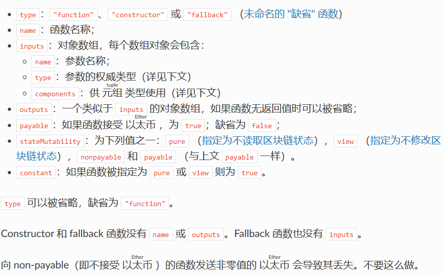
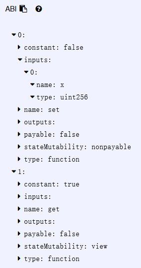
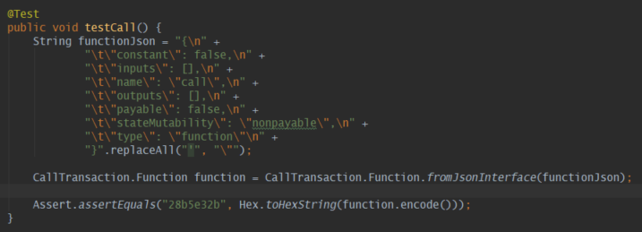
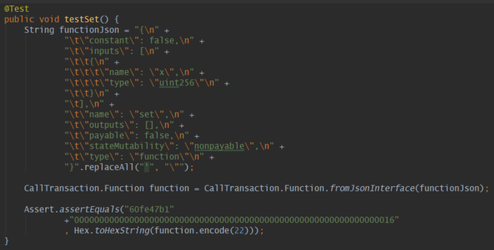
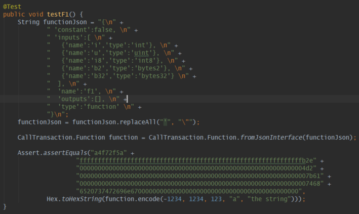

# 以太坊：根据ABI得到调用合约所需的payload

**欢迎转载，但须指明出处：**[https://github.com/chenjw13097/papers](https://github.com/chenjw13097/papers/blob/master/%E5%8C%BA%E5%9D%97%E9%93%BE/%E4%BB%A5%E5%A4%AA%E5%9D%8A%EF%BC%9A%E6%A0%B9%E6%8D%AEABI%E5%BE%97%E5%88%B0%E8%B0%83%E7%94%A8%E5%90%88%E7%BA%A6%E6%89%80%E9%9C%80%E7%9A%84payload/%E4%BB%A5%E5%A4%AA%E5%9D%8A%EF%BC%9A%E6%A0%B9%E6%8D%AEABI%E5%BE%97%E5%88%B0%E8%B0%83%E7%94%A8%E5%90%88%E7%BA%A6%E6%89%80%E9%9C%80%E7%9A%84payload.md)  

参考自：[https://solidity-cn.readthedocs.io/zh/develop/abi-spec.html](https://solidity-cn.readthedocs.io/zh/develop/abi-spec.html)  

### ABI是payload编码的依据

ABI，应用二进制接口（Application Binary Interface）。它是从区块链外部与合约进行交互以及合约与合约间进行交互的一种标准方式。根据它可以得到函数签名编码，同样根据它以及实际参数得到参数编码，两部分的字节序列拼接而得payload。  

### 函数签名编码

函数签名编码又叫函数选择器，是函数签名的 Keccak（SHA-3）哈希的前 4 字节。函数签名：函数名称加上由括号括起来的参数类型列表，参数类型间由一个逗号分隔开，且没有空格。函数的返回类型并不是这个签名的一部分。  

### 参数编码

参数类型可以分为：  
- 基础类型，如uint<M>、int<M>、address、uint、int、bool、fixed<M>x<N>、ufixed<M>x<N>、fixed、ufixed、bytes<M>、function。  
- 定长数组类型：<type>[M]。  
- 非定长数组类型：bytes、string（UTF-8）、<type>[]。  
  
以下类型被称为&quot;动态&quot;：  
- bytes  
- string  
- 任意类型 T 的变长数组 T[]  
- 任意动态类型 T 的定长数组 T[k] （k >= 0）  
- 由动态的 Ti （1 <= i <= k）构成的元组 (T1,...,Tk)  
所有其他类型都被称为&quot;静态&quot;。  

不同类型的参数编码方式不一样，下面以实际例子讲解。  

### payload编码原理

合约如下：  
```
pragma solidity ^0.4.16;

contract Foo {
  function baz(uint32 x, bool y) public pure returns (bool r) { r = x > 32 || y; }
  function bar(bytes3[2]) public pure {}
  function sam(bytes, bool, uint[]) public pure {}
}
```
想用 69 和 true 做参数调用 baz，我们总共需要传送 68 字节，可以分解为：  
- 0xcdcd77c0：方法ID。这源自ASCII格式的 baz(uint32,bool) 签名的 Keccak 哈希的前 4 字节。  
- 0x0000000000000000000000000000000000000000000000000000000000000045：第一个参数，一个被用 0 值字节补充到 32 字节的 uint32 值 69。  
- 0x0000000000000000000000000000000000000000000000000000000000000001：第二个参数，一个被用 0 值字节补充到 32 字节的 boolean 值 true。  
合起来就是:  
0xcdcd77c0 **0000000000000000000000000000000000000000000000000000000000000045** 0000000000000000000000000000000000000000000000000000000000000001  
如它返回 false，那么它的输出将是一个字节数组，一个bool值：  
0x0000000000000000000000000000000000000000000000000000000000000000  
  
想用 [&quot;abc&quot;, &quot;def&quot;] 做参数调用 bar，我们总共需要传送68字节，可以分解为：  
- 0xfce353f6：方法ID。源自 bar(bytes3[2]) 的签名。  
- 0x6162630000000000000000000000000000000000000000000000000000000000：第一个参数的第一部分，一个 bytes3 值 &quot;abc&quot; （左对齐）。  
- 0x6465660000000000000000000000000000000000000000000000000000000000：第一个参数的第二部分，一个 bytes3 值 &quot;def&quot; （左对齐）。  
合起来就是:  
0xfce353f6 **6162630000000000000000000000000000000000000000000000000000000000** 6465660000000000000000000000000000000000000000000000000000000000  
  
想用 &quot;dave&quot;、true 和 [1,2,3] 作为参数调用 sam，我们总共需要传送 292 字节，可以分解为：  
- 0xa5643bf2：方法ID。源自 sam(bytes,bool,uint256[]) 的签名。注意，uint 被替换为了它的权威代表 uint256。  
- 0x0000000000000000000000000000000000000000000000000000000000000060：第一个参数（动态类型）的数据部分的位置，即从参数编码块开始位置算起的字节数。在这里，是 0x60 。  
- 0x0000000000000000000000000000000000000000000000000000000000000001：第二个参数：boolean 的 true。  
- 0x00000000000000000000000000000000000000000000000000000000000000a0：第三个参数（动态类型）的数据部分的位置，由字节数计量。在这里，是 0xa0。  
- 0x0000000000000000000000000000000000000000000000000000000000000004：第一个参数的数据部分，以字节数组的元素个数作为开始，在这里，是 4。  
- 0x6461766500000000000000000000000000000000000000000000000000000000：第一个参数的内容：&quot;dave&quot; 的 UTF-8 编码（在这里等同于 ASCII 编码），并在右侧（低位）用 0 值字节补充到 32 字节。  
- 0x0000000000000000000000000000000000000000000000000000000000000003：第三个参数的数据部分，以数组的元素个数作为开始，在这里，是 3。  
- 0x0000000000000000000000000000000000000000000000000000000000000001：第三个参数的第一个数组元素。  
- 0x0000000000000000000000000000000000000000000000000000000000000002：第三个参数的第二个数组元素。  
- 0x0000000000000000000000000000000000000000000000000000000000000003：第三个参数的第三个数组元素。  
合起来就是:  
0xa5643bf2 **0000000000000000000000000000000000000000000000000000000000000060** 0000000000000000000000000000000000000000000000000000000000000001 **00000000000000000000000000000000000000000000000000000000000000a0** 0000000000000000000000000000000000000000000000000000000000000004 **64617665000000000000000000000000000000000000000000000000000000000** 000000000000000000000000000000000000000000000000000000000000003 **0000000000000000000000000000000000000000000000000000000000000001** 0000000000000000000000000000000000000000000000000000000000000002 **0000000000000000000000000000000000000000000000000000000000000003**  
  
实际上，函数返回值和事件的参数也会被用同样的方式进行编码。  

### ABI的JSON表示

一个描述函数的ABI的JSON表示含如下构成：  
  
  
当源码被编译后，就能得到函数的ABI，如Remix上的情况如下：  
  

### EthereumJ内置的payload编码工具

Java版Ethereum已经实现了编码功能的内置：  
  
  
  
可以看到，内置的功能可以直接输入ABI的JSON表示，然后给出实际的参数就可以得到整个的payload。  
