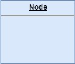
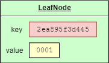
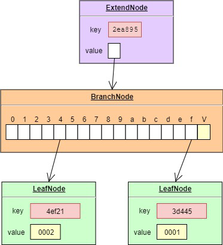
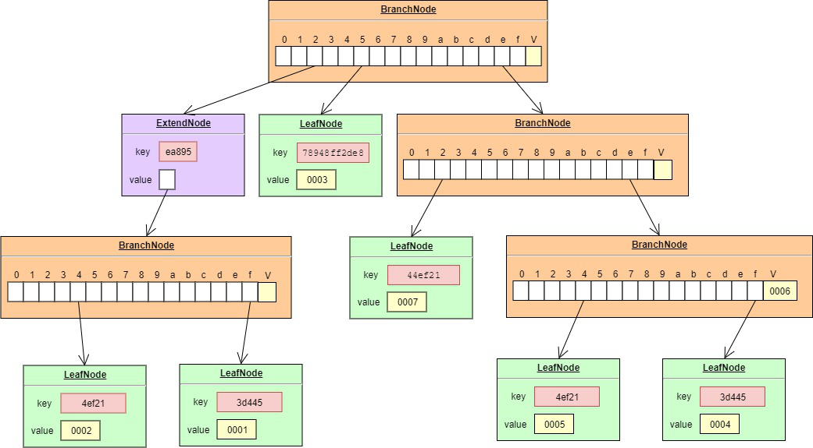
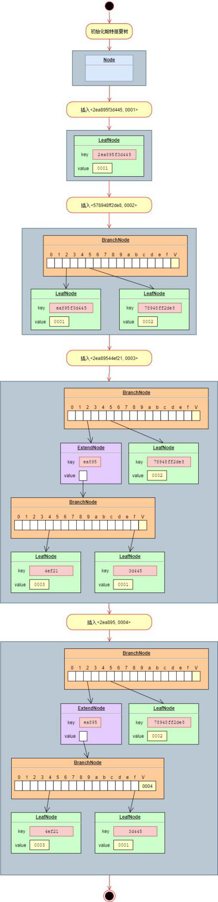
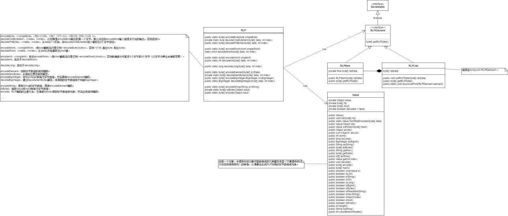

# 以太坊：版本控制设计

### 关于Patricia Tree操作对象的规定

Patricia Tree（帕特丽夏树）操作的对象为Key-Value对，不妨规定Key和Value都是字节数组。既然是字节数组，就有3种可能形式：其一为null，其二为空字节数组，即元素数为0，其三为常规字节数组，即元素数为正整数。所以Key-Value对就有9种可能形式，但为了使设计简单，更重要的是便于他人理解，且能证明做法同等有效的情况下，这里规定字节数组只能是常规字节数组。  
另外，规定帕特丽夏数的分支最多为16个，即正好对应16进制数。一字节包含两个16进制数，即表示为两个十六进制字符，因而自然推导出：Key和Value转为十六进制字符串后的长度只可能是2的倍数。  
帕特丽夏树有3种结点：分支结点、叶子结点、扩展结点。而且既然是树，它就有几种形态模式，即空树、只有一个结点和有多个结点。  
  
这里要先说明几个问题：  
1）Patricia Tree为什么操作的是Key-Value对？  
从后面的持久层存储看，这里的Key-Value，实际上都是作为Key-Value数据库的Value部分存储的，其Key是SHA3值。其实没有什么原因，这是Patricia Tree本身的特性。  
2）为什么规定Key和Value都是字节数组？  
使用字节数组，可以将存储的数据压缩到极致。而至于怎样由业务数据得到字节数组，则可以自己选择，就是说业务数据最终压缩到什么程度实际上由业务数据通过什么编码方式得到字节数组决定。  
3）为什么限定Key和Value都是常规字节数组？  
这主要是为了便于他人理解和降低难度。但实际上，应用不是出于阐述原理，所以都尽可能选择紧致的优化策略，这也就增加了考虑的细枝末叶，有时这种细枝末叶的工作量不比核心工作量少。但实际应用就是需要用这大量的功夫改进那百分之几的优化改善。总之，以太坊就没有这样限制。  
4）为什么规定分支最多16个？  
可以想象，如果我们的分支数刚好256，即一个字节，那么关于Key的分解就更简单了，就没有分解为十六进制的麻烦了，但分支这么多，一个结点耗的空间太大，虽然减低了树深，但不足以弥补代价。相反，如果分支数规定为4，即2位就够了，此时的Key的分解也麻烦，即4进制的处理。一个结点耗的空间减少，但共有部分Key的可能性增加，生成扩展结点的可能性大增。这是一个平衡，选择多少最佳，也许可以做成配置，然后进行压力测试。  

### Patricia Tree的数据结构

我们知道，Patricia Tree是从Trie（前缀树）改进得来的。根据Trie的定义性质和Patricia Tree对它的改进点，我们可以分析得到Patricia Tree可能的4种最终形态：  
1）根结点为空。  
  
2）根结点为叶子结点。叶子结点不能再扩展，即无子女结点。  
  
3）根结点为扩展结点。它指向的结点（子女结点）不能为空，否则不存值失去了存在的意义；也不能指向叶子结点，因为叶子结点不能再扩展，若指向叶子结点则会退化为根为叶子结点的情况；也不能指向扩展结点，因为如果是扩展结点，则效果等价于合并到作为根的扩展结点中去。所以，扩展结点的子女结点只可能是分支结点。  
  
4）根结点为分支结点。它指向的结点可以有多种，可以为空（分支结点有17个分支，可以为空的前提是至少有两个分支不为空），可以为叶子结点，可以为扩展结点，可以为分支结点。但不能有值，因为如果有值，就是说该值对应的Key的十六进制字符数为1，不满足Key必须是偶数个字符的规定。  
  
  
上面的描述中，我们只谈及根结点的情况，下面补充非根结点的情况：  
1）非根结点为空。不存在这种情况，或者说它就是双亲指向为空的情况。  
2）非根结点为叶子结点。与作为根时的叶子结点表现一样，即不能再扩展。  
3）非根结点为扩展结点。与作为根时的扩展结点表现一样。  
4）非根结点为分支结点。与作为根时的分支结点表现几乎一样，但它还可以指向一个值。  
结点为分支结点的图还展示了所有种类的非根结点情况。  
  
以太坊实现了MPT结构，将Merkle Tree（默克尔树）的部分剥离暂不考虑，就得到Patricia Tree，使用图中数据以调测方式运行，看到的结果与上面的描述和绘图是一致的。  
```
public class EthereumTest01 {
    @Test
    public void testRootIsNull() {
        TrieImpl trie = new TrieImpl();

        // 根哈希:=空字节数组->RLP编码->SHA3编码
        System._out_.println(Hex._toHexString_(trie.getRootHash()));
    }

    @Test
    public void testRootIsLeafNode() {
        TrieImpl trie = new TrieImpl();
        trie.put(Hex._decode_(&quot;2ea895f3d445&quot;), Hex._decode_(&quot;0001&quot;));

        System._out_.println(Hex._toHexString_(trie.getRootHash()));
    }

    @Test
    public void testRootIsExtendNode() {
        TrieImpl trie = new TrieImpl();
        trie.put(Hex._decode_(&quot;2ea895f3d445&quot;), Hex._decode_(&quot;0001&quot;));
        trie.put(Hex._decode_(&quot;2ea89544ef21&quot;), Hex._decode_(&quot;0002&quot;));

        System._out_.println(Hex._toHexString_(trie.getRootHash()));
    }

    @Test
    public void testRootIsBranchNode() {
        TrieImpl trie = new TrieImpl();

        // 根的子女结点为扩展结点
        // 扩展结点包含的Key部分，可以多个字符，也可以只有一个字符，比如将ea895换为3
        trie.put(Hex._decode_(&quot;2ea895f3d445&quot;), Hex._decode_(&quot;0001&quot;));
        trie.put(Hex._decode_(&quot;2ea89544ef21&quot;), Hex._decode_(&quot;0002&quot;));

        // 根的子女结点为叶子结点
        trie.put(Hex._decode_(&quot;578948ff2de8&quot;), Hex._decode_(&quot;0003&quot;));

        // 根的子女结点为分支结点
        // 非根的分支结点可以指向值
        trie.put(Hex._decode_(&quot;eef3d445&quot;), Hex._decode_(&quot;0004&quot;));
        trie.put(Hex._decode_(&quot;ee44ef21&quot;), Hex._decode_(&quot;0005&quot;));
        trie.put(Hex._decode_(&quot;ee&quot;), Hex._decode_(&quot;0006&quot;));
        trie.put(Hex._decode_(&quot;e244ef21&quot;), Hex._decode_(&quot;0007&quot;));

        System._out_.println(Hex._toHexString_(trie.getRootHash()));
    }
}
```

### Patricia Tree的操作

Patricia Tree的基本操作为初始化、插入、删除、修改、查询和销毁。结合实际应用，并根据Patricia Tree所有的最终形态，可以完成各个基本操作的编码设计。  
1）初始化。创建一个树对象，将根结点设置为空。  
2）插入。总是从根结点开始，通过Key的前缀匹配不断向叶子方向行进，之间会涉及到子树的结点新增、翻转调整等过程，这些过程最终目的都是为了调整得到Patricia Tree的最终形态。  
3）删除。是插入的逆过程。  
4）修改。在以太坊中的修改，实际上是增量形式提交的，就是说历史数据仍旧保留，业务上的修改就变为了Patricia Tree的插入，所以不单独提供修改操作了。  
5）查询。在以太坊中，查询过程是针对具体Key的，而非批量的，用到某个Key才会临时查询出对应的值。这结合了默克尔树的特性和RLP编码、SHA3编码，后续讲解。  
6）销毁。就是树对象不再使用了，由GC回收。  
  
下面是插入过程的一个举例：  
  

### 脏结点

在Patricia Tree中，任何一个结点连同它的子孙结点都可以被认为构成一棵树，它是这棵树的根。只要这棵树上的任何结点改变了，则称该结点变脏，成为脏结点。特别地，新增结点也是脏结点。  
对Patricia Tree进行插入、删除、修改操作均能导致结点变脏，称这些操作为脏操作。  

### 最终形态的树包含的结点

对于一棵全新的空树，不存在历史结点，所以不断执行操作，得到的最终形态的树的所有结点都将是脏结点。而如果树是从某个历史根哈希开始的，那么在脏操作的过程中，会顺带从持久层读取出同在新的脏结点的路径上的结点，并且这样的结点的兄弟结点也会被带出，但尚未解析，即只保留了其RLP编码值或SHA3值。而在非脏操作中，则直接带出了解析或未解析的非脏结点。但无论哪种情况，这棵树新添加的或带出的都只可能是实际操作中使用到的值，即针对特定的值，是点查询而非批量查询。  

### 对结点进行编码

上面讲述了经过一番操作后，树的最终形态的结点情况。编码只会是以脏结点为中心，纳入了其兄弟结点的编码。或者说，编码针对的是一棵被裁剪了的虚拟树，这棵树只包含了脏结点和脏结点带出的非脏兄弟结点，而这些非脏兄弟结点都是未解析的，只保留了其RLP编码值或SHA3值。而如果不是带出的，那么这些非脏兄弟结点实际上是空。  
  
对结点进行编码，使用的主要是RLP编码，而SHA3编码只是起到映射长RLP编码值（等于或大于32字节）和映射整棵树根RLP编码值的作用。  
1）编码分支结点  
对16个子元素和1个值子元素分别进行RLP编码，然后对这17个RLP编码值进行RLP编码。  
如果子元素为空，则其RLP编码值为空字节数组的RLP编码。  
如果子元素是带出来的，则其RLP编码值为哈希的RLP编码，或者是RLP编码值自身。  
如果子元素是脏结点，则其RLP编码值为对该结点的编码，这是一个递归过程。  
对于值子元素，则其RLP编码值为直接对该字节数组进行RLP编码。  
2）编码扩展结点  
对Key和子结点分别进行RLP编码，然后对这2个RLP编码值进行RLP编码。  
对子结点进行RLP编码，也是一个递归过程。  
3）编码叶子结点  
对Key和Value分别进行RLP编码，然后对这2个RLP编码值进行RLP编码。  
  
上面3点即结点的编码过程，梳理这个过程可以发现，它是一个递归算法，即树的后根遍历过程。每完成一个结点的RLP编码（从最左的结点开始），就有一个后处理过程：将其缓存里的哈希-RLP编码值映射删除，如果存在；置本结点为非脏结点；而如果此RLP编码值等于或大于32字节，或者结点为整棵树的根结点，则还计算RLP编码值的SHA3哈希，并放在缓存；而且该结点的RLP编码值也重置为对该SHA3哈希的RLP编码。  
上面的描述参考自源码：org.ethereum.trie.TrieImpl#getRootHash  
  
我们看到了对结点编码实际上用的是RLP编码。有几个问题需要说明下：  
1）编码后，为什么要将结点在缓存里的哈希-RLP编码值映射删除，如果存在？  
首先这里的缓存无非来自两个地方，一是持久层，即之前说的&quot;带出&quot;过程，对于这种情况直接删除即可，因为它既不需要重新存入（没有改变操作持久层徒增消耗），也不需要为树保留，因为树上有了这些信息，甚至更新。二是来自树上一次编码的缓存，此次再编码，更改的结点既然有编码的动作，则对应的编码自然用最新的，上次的不需要了，而没有更改的则依旧在此缓存里。  
2）为什么置本结点为非脏结点？  
编码是总是针对整棵树编码的，编码后，根无论是否足32字节RLP编码，都需要计算哈希值，作为整个此时状态的入口。而且，状态会存入缓存和根哈希中的，是完整的。此时的树可以以全新的干净的形式接纳新的操作变更。  
3）为什么整棵树的根的RLP编码值要强制指定一个哈希值为Key？  
因为底层是存储Key-Value对的，如果没有哈希值为Key，那么总要想个法子造出一个Key来，与其这样，直接计算一个哈希值就好了。  
4）为什么等于或大于32字节的RLP编码值要指定一个哈希值为Key？  
假设不指定，那么某个结点的RLP编码值可能非常长，越往上靠近根结点越长。但我们知道，在操作过程中，某些值在没用用到而只是被带出来时是保留RLP编码值或SHA3值的。显然如果不计算，那么就只能是RLP编码值，可能会很长，而有了计算，就可以只保留最多32字节的SHA3或小于32字节的RLP编码值。而且，通过SHA3与RLP编码值的映射，可以控制在持久层的一个记录不至于太大，大小也均匀。而这里等于32字节的RLP也编码，主要是为了后续准确区别，就是说凡是32字节的，我都当做SHA3处理，而非RLP编码值。  

### RLP：以太坊底层序列化编码方式

#### 简介

[https://segmentfault.com/a/1190000011763339](https://segmentfault.com/a/1190000011763339)  
[https://github.com/ethereum/wiki/wiki/RLP](https://github.com/ethereum/wiki/wiki/RLP)  
RLP，Recursive Length Prefix，递归长度前缀。它是以太坊底层序列化采用的编码方式。RLP主要用于以太坊中数据的网络传输和持久化存储。它的设计目的就是编码任意嵌套的二进制数组或列表。  
  
序列化对象的编码方式有很多种，为什么还要重复发明轮子呢？常见的JSON编码，有个明显的缺点，就是引入了太多冗余信息，编码结果比较大。而其他的编码方式，要么不为以太坊设计者所知，要么看起来都不如自己设计的编码来的合适。  

#### 原理

RLP编码只对3种数据类型编码：  
**类型1：** 值在[0，127]之间的单个字节。使用下面的规则1。  
**类型2：** 字节数组（元素数可为0）。使用下面的规则2和规则3。  
**类型3：** 列表（列表是以数组或列表为元素的数组，元素数不可为0）。使用下面的规则4和规则5。  
  
RLP编码的编码规则：  
**规则1：** 对于值在[0，127]之间的单个字节，其编码是字节自身。  
9->9  
**规则2：** 对于长度len<=55的字节数组，其编码是128+len，紧接着字节数组自身。  
[9]->[129，9]  
len=1  
129=128+len  
**规则3**** ：**对于长度len>55的字节数组，其编码是183+len编码的长度，紧接着len的编码，紧接着字节数组自身。len的大小不能超过8字节能表示的值。  
[97，97，...，97]->[185，4，0，97，97，...，97]  
len=1024  
[4，0]=len的编码（编码涉及多字节的数值表示时，使用大端模式）  
185=183+[4，0]的长度  
**规则4：** 如果列表长度len<=55，其编码是192+len，紧接着各子列表的编码。 **列表长度** 是指子列表编码后的长度之和。这是递归定义。  
[[97，98，99]，[100，101，102]]->[200，131，97，98，99，131，100，101，102]  
131=128+3  
200=192+4+4  
**规则5：** 如果列表长度len>55，其编码是247+len的编码的长度，紧接着len的编码，紧接着各子列表的编码。len的大小不能超过8字节能表示的值。这是递归定义。  
[&quot;The length of this sentence is more than 55 bytes, &quot;, &quot;I know it because I pre-designed it&quot;]->[24888179 84 104 101 32 108 101 110 103 116 104 32 111 102 32 116 104 105 115 32 115 101 110 116 101 110 99 101 32 105 115 32 109 111 114 101 32 116 104 97 110 32 53 53 32 98 121 116 101 115 44 32 163 73 32 107 110 111 119 32 105 116 32 98 101 99 97 117 115 101 32 73 32 112 114 101 45 100 101 115 105 103 110 101 100 32 105 116]  
179 = 128 + 51  
163 = 128 + 35  
88 = 51+35 + 2  
248 = 247 +1  
  
从编码规则可以看出：编码的结果是一个字节数组。编码结果的长度不能超过8字节能表示的值，也就是2的64次方，2ZB的数据，这是很大的数据了。  
各种程序设计语言在实现RLP编码时，需要首先将对象转换为3种数据类型中的一种，具体怎么转换则自己定义。  
  
RLP编码的解码规则是编码规则的逆运算。首先根据编码结果的第一个字节f，执行以下的规则判断：  
**判断1：** 如果f∈[0，127]，那么反序列化后是一个字节，就是f。  
**判断2：** 如果f∈[128，183]，那么反序列化后是一个长度len<=55的字节数组，字节数组的长度为len=f-128。  
**判断3：** 如果f∈[184，192]，那么反序列化后是一个长度len>55的字节数组，字节数组长度的编码的长度lenOfLen=f-183，然后从第二个字节开始读取lenOfLen个字节，按照大端模式转换成整数len，len即为字节数组的长度。  
**判断4：** 如果f∈[193，247]，那么反序列化后是一个编码后长度len<=55的列表，列表长度为len=f-192。递归使用判断1~4进行解码。  
**判断5：** 如果f∈[247，255]，那么反序列化后是编码后长度len>55的列表，列表长度的编码的长度lenOfLen=f-247，然后从第二个字节开始读取lenOfLen个字节，按照大端模式转换成整数len，len即为子列表总长度。然后递归使用判断1~5进行解码。  
  
可以看到，接收到编码的数据后，1）就能根据第一个字节推断出数据的类型，2）并且最多再读几个字节就能知道数据的大小，这就解释了&quot;长度前缀&quot;的意义。加之解码时使用了递归算法，因而此编码方式就叫递归长度前缀编码。  

#### 源码实现

源代码见：org.ethereum.util.RLP  
  
源码实现与原理描述有两点稍有不同：  
1）实际上不只提供了3种数据类型，但其他类型都转换成这3种后才编码，且每种类型都对应了编码和解密方法。也就是说，收方知道收到的数据是用什么方法编码的，它会调用对应的方法解密。  
2）实际使用的规则可能稍有出入，也更琐碎些。  
  

### 总结：版本控制过程和原理

根据上面关于Patricia Tree和Merkle Patricia Tree的讲解。现在总结下版本控制的过程，这里假设版本控制的对象为区块的世界状态。  
1）当前提交了第N个区块，世界状态的根哈希为RootHash-N。  
2）现在开始启动执行第N+1个区块。  
3）首先，使用RootHash-N初始化Merkle Patricia Tree，此时会创建一个根结点，并将RootHash-N赋给它为SHA3哈希。  
4）这里假设创建合约，此时会生成一个地址。以此地址为Key从树得不到合约账户，接着就创建一个并持久化，这发生在账户的树上。接着里面合约初始化方法可能有设置值，此时又操作另一棵树，即该合约账户私有的一棵树，合约树。  
5）执行完成后，合约树上记录了合约的状态，将它编码，最后的根哈希设置为账户的一部分。然后，返回的存储代码则因为是部署后就不变的特性，所以直接走了普通的缓存，没有经过树及其缓存。最后账户树编码，得到根结点哈希。  
6）最后如果决定提交，则将缓存中的数据（合约树缓存里的合约状态、账户树缓存里的账户世界状态、普通缓存里的地址代码映射）刷到持久库里。并将账户树的根哈希设置到区块中，并提交区块，即持久化到数据库。  
  
可见，版本控制的原理主要在于MPT，即Merkle Patricia Tree的应用。一旦对它编码，其得到的根哈希和缓存数据就构成了当时的状态。对此状态，我们可以选择提交，也可以选择放弃。一旦提交，那么从区块提取了账户根哈希出来，就可以得到该区块提交时的任何账户、合约的当时状态。
  