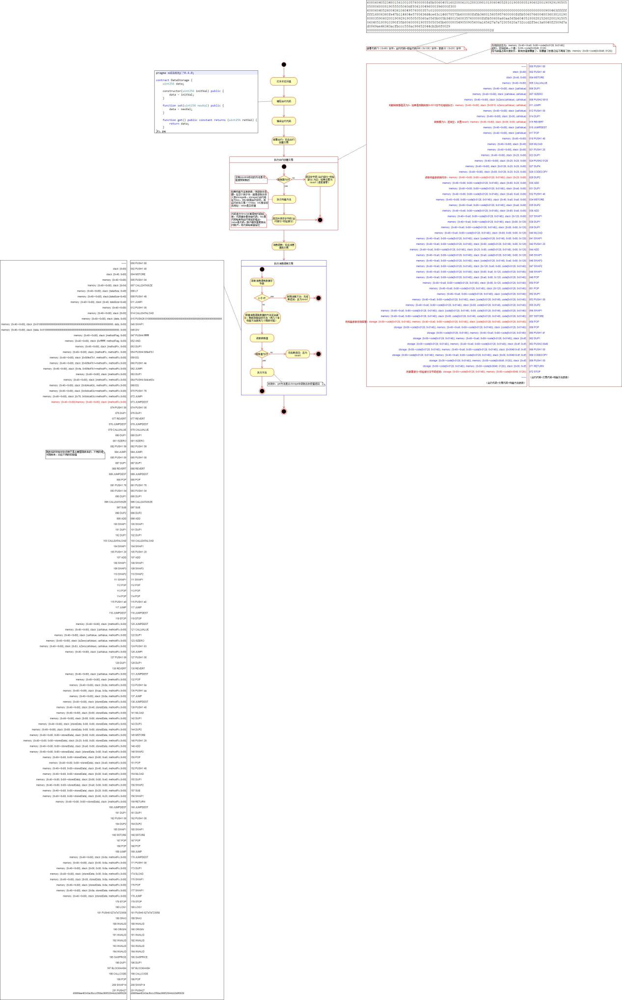

# 以太坊：虚拟机执行过程

**欢迎转载，但须指明出处：**[https://github.com/chenjw13097/papers](https://github.com/chenjw13097/papers/blob/master/%E5%8C%BA%E5%9D%97%E9%93%BE/%E4%BB%A5%E5%A4%AA%E5%9D%8A%EF%BC%9A%E8%99%9A%E6%8B%9F%E6%9C%BA%E6%89%A7%E8%A1%8C%E8%BF%87%E7%A8%8B/%E4%BB%A5%E5%A4%AA%E5%9D%8A%EF%BC%9A%E8%99%9A%E6%8B%9F%E6%9C%BA%E6%89%A7%E8%A1%8C%E8%BF%87%E7%A8%8B.md)  
  
Solidity合约编译后，得到字节码，虚拟机执行此字节码完成合约的部署或调用。  
  
