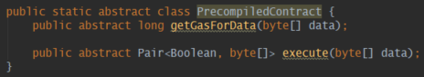
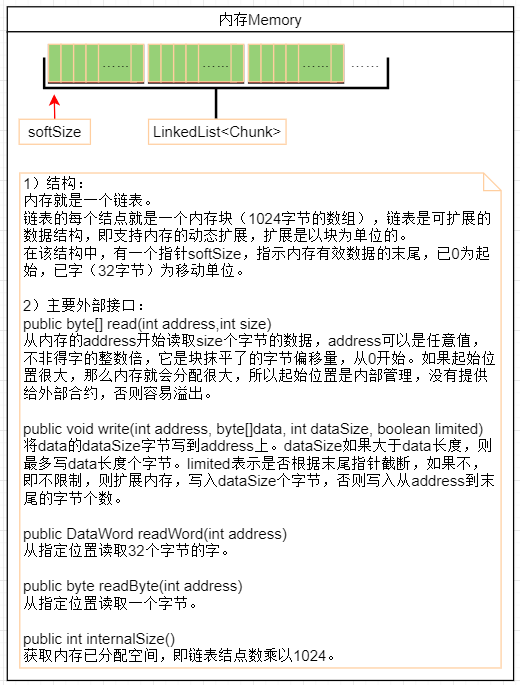
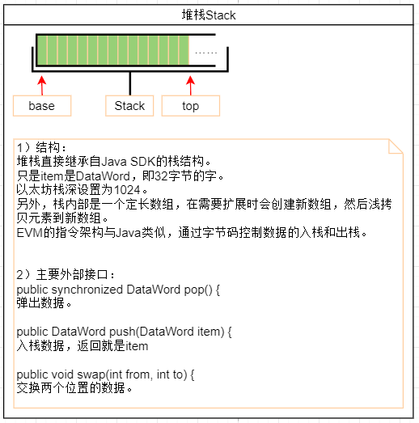
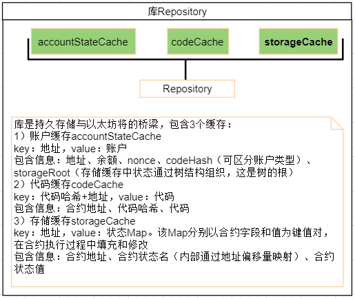

# 以太坊：虚拟机执行过程中的相关数据结构

**欢迎转载，但须指明出处：**[https://github.com/chenjw13097/papers](https://github.com/chenjw13097/papers/blob/master/%E5%8C%BA%E5%9D%97%E9%93%BE/%E4%BB%A5%E5%A4%AA%E5%9D%8A%EF%BC%9A%E8%99%9A%E6%8B%9F%E6%9C%BA%E6%89%A7%E8%A1%8C%E8%BF%87%E7%A8%8B%E4%B8%AD%E7%9A%84%E7%9B%B8%E5%85%B3%E6%95%B0%E6%8D%AE%E7%BB%93%E6%9E%84/%E4%BB%A5%E5%A4%AA%E5%9D%8A%EF%BC%9A%E8%99%9A%E6%8B%9F%E6%9C%BA%E6%89%A7%E8%A1%8C%E8%BF%87%E7%A8%8B%E4%B8%AD%E7%9A%84%E7%9B%B8%E5%85%B3%E6%95%B0%E6%8D%AE%E7%BB%93%E6%9E%84.md)    

### 账户

org.ethereum.core.AccountState  
可用来表示外部账户或合约账户。  
含nonce、余额、状态根、代码哈希。  
  
private final BigInteger nonce  
对于外部账户，nonce表示从此账户发出的交易数量。  
对于合约账户，nonce表示此合约内创建的合约数量。  
设计nonce的目的是为了防止重放攻击，也就是防止一个交易被多次执行，因为每执行一个交易时，库中该交易发送者账户的nonce就会增加1。  
默认值是从配置常量取出的0。  
  
private final BigInteger balance  
账户的余额，以Wei为单位。  
默认为0。  
  
private final byte[] stateRoot  
用于存储合约内容Trie结构的哈希根。  
默认是sha3(RLP.encodeElement(EMPTY\_BYTE\_ARRAY))。  
  
private final byte[] codeHash;  
合约代码的哈希值。  
默认值是sha3(EMPTY\_BYTE\_ARRAY)。  
  
提供了RLP编码和解码方法，以及编码结果缓存。  
只要代码哈希或nonce不是默认的，则认为合约是存在的。  
所谓空账户，是指代码哈希、nonce、余额都是默认的。空账户是需要被删除的。  

### 预编译合约

org.ethereum.vm.PrecompiledContracts.PrecompiledContract  
  
以太坊有几个预编译合约，每一个都是确定功能的，它们有统一的格式：地址、根据交易data计算费用、根据交易data进性逻辑处理最后返回是否执行成功及返回值。  
  

### VM内存

  
  
1）实现类  
public class Memory implements ProgramListenerAware  
  
2）结构  
private List\&lt;byte[]\&gt; chunks = new LinkedList\&lt;\&gt;();  
内存就是一个链表。  
链表的每个结点对应一个内存块，一个内存块1024字节，链块内存是可扩展的，扩展是以块为单位的。  
  
private int softSize;  
在内存中，有一个指针softSize，用于指示存储数据的末尾。  
  
3）外部接口  
public byte[] read(int address, int size) {  
从内存的address（块抹平了的字节偏移量，从0开始，如1025代表第1块第1个位置）开始读取size个字节的数据。  
address可以超过存储数据的末尾。  
读取时，如果被读数据超出了末尾指针的范围，则会以块为单位增加块数，也就是说读到的新增数据是0。而末尾指针则以字，即32字节为单位移动，最终移动到被读数据的末尾。  
  
public void write(int address, byte[] data, int dataSize, boolean limited)  
将data的dataSize字节写到address上。  
dataSize如果大于data长度，则最多写data长度个字节。  
limited表示是否根据末尾指针截断，如果不，即不限制，则扩展内存，写入dataSize个字节，否则写入从address到末尾的字节个数。  
  
public void extendAndWrite(int address, int allocSize, byte[] data) {  
扩展然后写入数据。  
  
public void extend(int address, int size) {  
扩展内存，扩展了后末尾指针就变化。  
  
public DataWord readWord(int address) {  
从指定位置读取32个字节的字。  
  
public byte readByte(int address) {  
从指定位置读取一个字节。  
  
public int size() {  
获取末尾指针的位置。  
  
public int internalSize() {  
获取内存以分配空间，即链表结点数乘以1024。  
  
public List\&lt;byte[]\&gt; getChunks() {  
获取内存副本。  
  
public String toString() {  
以打印格式（含16进制和assii码形式）返回内存数据，softSize结尾。  
  
4）程序监听  
programListener.onMemoryExtend(toAllocate)  
programListener.onMemoryWrite(address, data, dataSize)  
在内存扩展（这里的扩展指应的字数）和写数据是会触发监听器。  

### VM堆栈

  
  
1）实现类  
public class Stack extends java.util.Stack\&lt;DataWord\&gt; implements ProgramListenerAware {  
  
2）结构  
直接继承自Java的Stack：  
protected Object[] elementData;  
只是item是DataWord，即32字节的字。  
可以看到这是一个定长数组，在需要扩展时会创建新数组，然后浅拷贝元素到新数组。  
以太坊栈深设置为1024。  
  
3）外部接口  
public synchronized DataWord pop() {  
弹出数据。  
  
public DataWord push(DataWord item) {  
入栈数据，返回就是item  
  
public void swap(int from, int to) {  
交换两个位置的数据。  
  
4）程序监听  
programListener.onStackPop();  
programListener.onStackPush(item);  
programListener.onStackSwap(from, to);  

### VM持久化存储

  