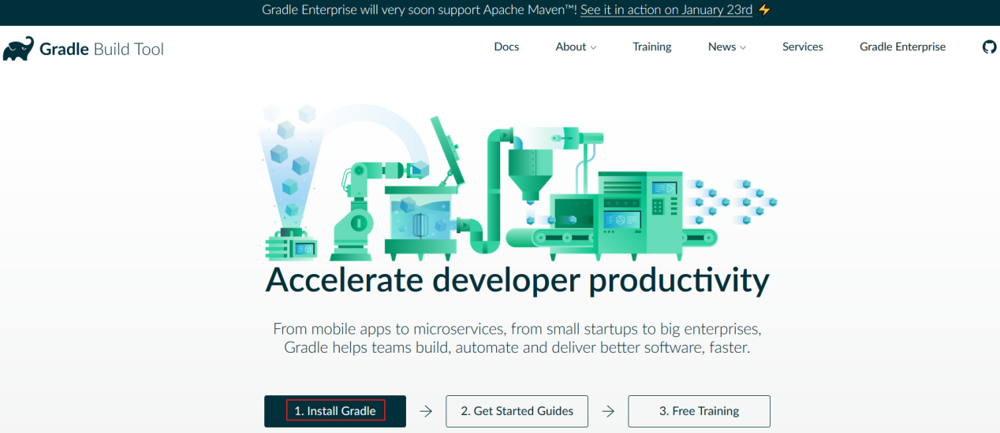
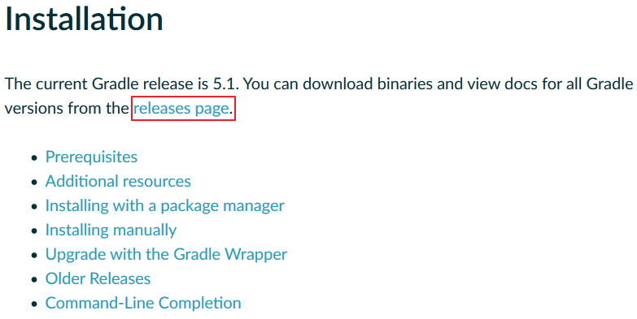
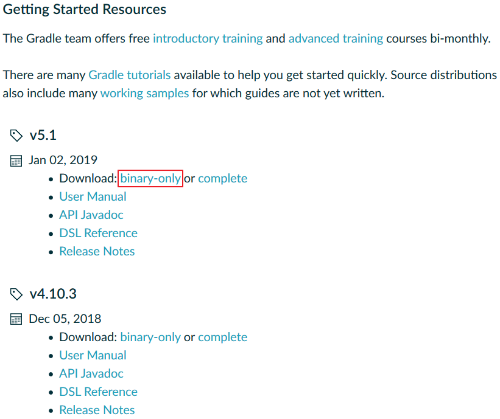
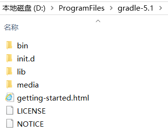
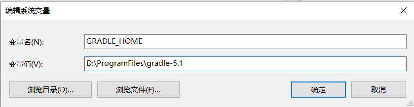
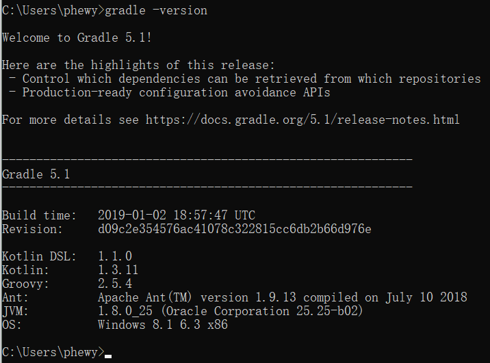

# Gradle

进入Gradle官网：[https://gradle.org/](https://gradle.org/)。

点击Install Gradle。

 
	
	
点击releases page。

 
 

选择最新版的binary-only。

 
 

下载后，解压到指定目录即完成安装，如下。

 
 

设置环境变量。

 
 

Path环境变量增加一项。

 
 

运行命令gradle -version，检查安装和配置是否成功。

 